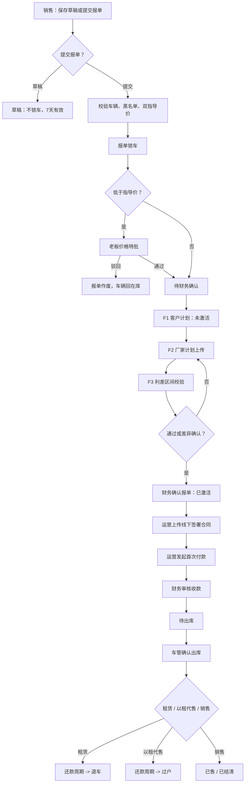

# 6.2 流程闭环复查报告

> 复查日期：2026-06-04
> 依据文档：`docs/功能描述文档-6.2-v1.md`
> 对照对象：`app.py`、`database.py`、`templates/index.html`、`docs/workflows/*.mmd`、`tests/test_full_flow.py`

## 一、结论

当前项目不是“完全不能运行”，但也不是“按 6.2 完整闭环”。后端基础导入和现有自动化主流程可跑通，`python3 -m unittest tests.test_full_flow -v` 共 18 项通过；`pytest` 在当前环境未安装，不能作为本次判断依据。

真正的问题是：现有代码、页面、流程图没有统一收敛到 6.2。主链路有几段已经接上，但有几处关键门禁和自动触发仍不完整，所以从业务验收角度会感觉“整个项目没有通”。

总体判断：

| 模块 | 6.2 要求 | 当前实现 | 通畅性 |
|---|---|---|---|
| D/E 报单与价格特批 | 在库车提交即锁车，低价才老板审批，驳回作废 | 后端已实现车辆在库校验、双指导价校验、低价审批、锁车 | 基本通 |
| F 计划生成与比对 | 待财务确认前生成客户计划，上传厂家计划，利差区间判定 | 已有 F1/F2/F3；F3 已按利差区间判定，期数/首末期仅展示 | 基本通 |
| E2 财务确认报单 | F3 通过或差异确认后才能激活 | 后端有 blocker 阻断未上传/未通过计划 | 基本通 |
| G 合同与首款 | 运营上传线下签署合同后，直接进入首款/押金审核 | 已改为上传线下合同，不再生成财务合同审批 | 基本通 |
| G3 出库门禁 | 以租代售校验首付款；租赁校验押金+首期；至少 3 张照片 | 当前只靠 `delivery_status='待出库'`，并校验照片路径和出库单路径，没有 3 张照片结构化校验 | 半通 |
| H 逾期与滞纳金 | 每日 `逾期N日`，万5/日，押金/首付不抵扣 | 已有 `/api/jobs/daily-collect` 和 `late_fee_ledger` | 基本通 |
| I 核销瀑布 | 客户真实到账核销，先费用再租金，滞纳金最低优先级 | 已有瀑布核销与测试覆盖 | 基本通 |
| H4 锁车/解锁 | 销售申请 -> 运营审核 -> 老板审批 -> 销售线下确认 | 后端接口齐全，但旧审批中心仍有 `lock_request` 残留文案/角色描述 | 半通 |
| M 退车 | 销售发起 -> 车管 -> 运营 -> 财务 -> 老板 -> 出款入库 | 后端分步基本齐；但存在通用审批和退车自有审批两个入口 | 基本通但体验混乱 |
| N 过户 | 以租代售末期核销后自动待过户；租赁不进过户 | 后端可手动发起过户并有守卫；未看到末期核销自动生成过户单 | 半通 |
| L 发票 | 已还款期次才可申请，大额需老板审批，红冲凭证必填 | 有基础发票申请/开票/作废/红冲；大额老板审批和已收款前置不完整 | 半通 |
| S 黑名单 | `警示/拒绝` 两级，警示进老板审批，拒绝阻断 | 当前更像单一“生效即阻断”，level 使用 `禁止报单` | 未按 6.2 完整实现 |
| 流程图 | 应体现 6.2 新状态和门禁 | `docs/workflows/*.mmd` 多数仍是旧口径 | 不通 |

## 二、6.2 主流程图

可单独渲染文件：`docs/workflows/6.2-main-flow.mmd`

## 三、关键不通畅点

### 1. 现有流程图不是 6.2 版本

`docs/workflows/global.mmd`、`sale.mmd`、`rental.mmd`、`lease-to-sale.mmd` 还保留旧口径，例如：

- 老板驳回仍写“价格特批驳回”，6.2 已统一为 `已作废`。
- 财务确认报单前没有体现 F1/F2/F3 是前置。
- 出库仍像“运营发起出库 -> 财务确认 -> 车管出库”，而当前口径的关键门禁是线下合同上传、首次付款审核通过后由车管出库。
- 租赁末期直接“进入退车流程”的表达过粗，没有体现销售发起、车管、运营、财务、老板、出款。

这会直接误导实现和验收。

### 2. 出库门禁不够硬

6.2 要求：

- 以租代售：首付款到账即可出库，不要求第一期月供。
- 租赁：押金 + 第一期租金都到账才可出库。
- 出库照片至少 3 张：车头、车尾、驾驶位仪表。

当前后端在 `app.py` 的首次付款审批通过时会写回 `delivery_status='待出库'`、押金/首付状态、租赁首期自动核销，这是好的。但真正出库接口只校验：

- 合同 `delivery_status='待出库'`
- `delivery_photo_path` 和 `delivery_document_path` 两个路径存在

没有在出库接口再次按合同类型核验 `down_payment_status`、`deposit_status`、第一期还款状态，也没有结构化校验 3 张照片。因此如果前序状态被误写，出库门禁会被绕过。

### 3. 自然结清到过户未自动闭环

6.2 的 N1 是：以租代售合同最后一期核销后，满足结清条件就自动生成 `ownership_transfers(status='待过户')`，租赁合同则只生成待退车提示，不进入过户。

当前后端 `create_ownership_transfer` 有守卫：

- 只允许 `contract_type='以租代售'`
- 审核中减免阻断
- 客户分期未结清阻断

但它是运营手动调用。没有看到 I2 核销末期后自动创建自然结清过户单的挂点。这会导致以租代售末期还清后，流程停在“账单已还款”，不自动推运营过户。

### 4. 退车流程入口重复

退车分步接口本身基本符合 6.2：

销售发起 -> 车管验车 -> 运营填数据 -> 财务复核 -> 老板审批 -> 财务出款 -> 回库或待维修。

但当前既有 `boss-approve` 专用接口，也有通用审批中心 `return_stock` 审批逻辑。两套入口都能表达“老板领导审批”，页面上容易让用户困惑：到底从退车单按钮审批，还是从审批中心审批。

### 5. 发票与黑名单还不是 6.2 完整口径

发票：

- 当前有申请、开票、作废、红冲。
- 但未严格体现“首期/后续期数必须已还款才可申请”。
- 未体现“大额发票需老板审批”。
- 红冲接口要求红字发票号和原因，但红冲凭证是否必填不够硬。

黑名单：

- 6.2 是 `警示/拒绝` 两级。
- 当前是 `status='生效'` 直接阻断，前端默认 level 为 `禁止报单`。
- 没有实现“警示可继续提交但进入老板审批”的分支。

### 6. 角色/页面文案仍有旧口径

前端 `templates/index.html` 中仍有一些旧描述：

- 锁车审批流程区域写“财务审批 / 终审确认锁车”，但 6.2 是运营审核 -> 老板审批 -> 销售线下确认。
- 审批中心文案曾把“合同审批”“锁车审批”混在旧流程口径中；合同审批入口已改为线下合同上传，仍需继续清理旧流程图中的历史表述。
- 资产状态筛选中有“已锁车”，但 6.2 把车辆经营状态和 `lock_status` 拆成两个维度。

## 四、建议修复顺序

1. 先替换旧流程图：以 `docs/workflows/6.2-main-flow.mmd` 为主干，拆出租赁、以租代售、退车、锁车 4 张 6.2 子流程图。
2. 加强 G3 出库后端门禁：按合同类型重新校验首付/押金/首期租金，并把出库照片改为结构化数组，后端校验数量不少于 3。
3. 补 N1 自动触发：I2 核销后若 `contract_type='以租代售'` 且全部期次结清，自动创建自然结清过户单；若 `contract_type='租赁'` 且末期结清，生成销售“待退车”提示。
4. 收敛退车老板审批入口：保留一个主入口，另一个入口只做跳转或兼容。
5. 补 L/S 周边规则：发票已收款前置、大额审批、红冲凭证必填；黑名单改为 `警示/拒绝` 双分支。
6. 清理前端文案和按钮条件，让页面文字与 6.2 状态字典一致。

## 五、本次验证

- `python3 -m unittest tests.test_full_flow -v`：18 项通过。
- `python3 -c 'import app; print("import ok", app.app.name)'`：通过。
- `python3 -m pytest -q`：未执行成功，原因是当前环境未安装 `pytest`。

## 六、复查后的判断

若按“代码能否启动、测试能否跑”判断，项目不是完全断。

若按“6.2 文档要求的业务闭环”判断，目前只能算主干半闭环：D/E/F/G/H/I 的主要后端链路已接上，但 G3、N1、L、S、流程图和前端引导还没有完全对齐。要让业务方感觉“流程通了”，优先要修的是出库门禁、自然结清过户自动触发、旧流程图和前端旧文案。
