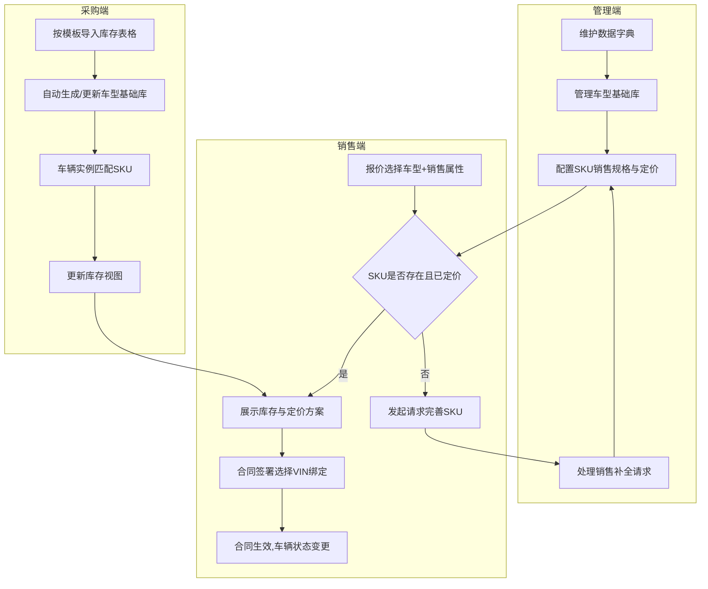

车辆租赁与以租代售管理系统

SKU管理模块核心产品设计文档 V3.0

文档版本 修改日期 修改人 修改内容
V3.0 2026-08-07 AI助手 整合车型基础优化、双重筛选模式、合同VIN绑定，形成完整设计

---

1. 业务背景与目标

1.1 业务模式

系统支撑两种核心销售方式：

· 车辆租赁：客户按月支付租金获得车辆使用权。
· 以租代售：客户支付首付后按月支付租金，约定期满后车辆所有权转移给客户。

1.2 核心目标

建立一个灵活、准确、高效的车辆SKU管理体系，向上支撑销售报价，向下关联采购库存与合同履约，解决以下核心问题：

· 车辆规格由多维度属性定义，且能源类型不同属性也不同（油/混动：马力、档位；纯电：电池度数）。
· 销售价格需根据租赁/以租代售两种方式分别定义，且以租代售支持多个方案。
· 销售报单时需能快速定位SKU、查看实时库存，并在管理端缺项时发起补全请求。
· 合同签署时需将销售规格（SKU）绑定至具体车辆（VIN码）。

---

2. 用户角色与职责

角色 核心职责 所属端口
管理 维护数据字典、车型基础库；配置SKU销售规格与定价方案；处理销售端发起的SKU补全请求。 管理端
销售 在报单环节快速筛选SKU及定价方案；发起SKU补全请求；在合同环节完成VIN绑定。 销售端
财务 查看订单金额、对账、开票等（本文档不展开）。 管理端/独立端
运营 监控库存、分析销售数据等（本文档不展开）。 管理端/独立端
采购端(系统) 按固定模板提供车辆库存表格，驱动库存视图更新。 接口/导入

---

3. 核心数据模型

3.1 基础数据字典 (管理端维护)

所有规格族均支持动态自定义，只有“成色”为固定枚举。

规格族 说明 适用能源类型 是否动态 示例值
能源类型 基础属性 全部 动态 纯电动、混动、燃油
成色 固定属性 全部 固定 新车、二手车
品牌 动态属性 全部 动态 比亚迪、一汽解放
品系 依赖品牌 全部 动态 秦Plus、J6P (与品牌联动)
箱型 动态属性 全部 动态 厢式、栏板、冷藏
尾板 动态属性 全部 动态 有、无
电池度数 电车专有 纯电动 动态 50度、80度
马力 油车/混动车 混动、燃油 动态 160马力、460马力
档位 油车/混动车 混动、燃油 动态 6档手动、8档自动

混动车特殊处理：混动车可同时配置“电池度数”和“马力/档位”，SKU生成时允许此类组合。

3.2 车型基础 (核心优化实体)

从采购端库存表中提取，代表由厂家实际生产的唯一车型核心参数组合。

· 属性结构：
  字段 类型 说明
  车型ID UUID 主键
  能源类型 枚举 关联数据字典
  品牌 字符串 关联数据字典
  品系 字符串 关联数据字典，依赖品牌
  电池度数 字符串 仅纯电必填，其他可空
  马力 字符串 仅油车/混动必填，其他可空
  档位 字符串 仅油车/混动必填，其他可空
  状态 枚举 启用/停用
· 数据来源：
  · 自动提取：每次导入采购库存表格时，系统解析每辆车数据，提取出新的“能源类型+品牌+品系+电池度数/马力/档位”组合，若车型基础库中不存在，则自动新增（可标记为“待完善”）。
  · 手动维护：管理端可手工新增、编辑、停用。

3.3 SKU销售规格 (SKU主表)

代表一个唯一可售的车辆规格，由“车型基础 + 销售属性”共同决定。

· 属性结构：
  字段 类型 说明
  SKU ID UUID 主键
  车型ID 外键 关联车型基础
  成色 枚举 新车/二手车
  箱型 字符串 关联数据字典
  尾板 字符串 有/无
  状态 枚举 生效/失效
  创建时间 时间戳 
· 唯一性约束：车型ID + 成色 + 箱型 + 尾板 组合唯一。

3.4 SKU定价方案

每个SKU可配置租赁定价（唯一）和以租代售定价（多个方案）。

字段 类型 说明
定价ID UUID 主键
SKU ID 外键 关联SKU
销售方式 枚举 租赁 / 以租代售
方案名称 字符串 以租代售时必填，如“0首付高月供”；租赁可为空或固定为“标准租赁”
月租金 金额 必填
首付款 金额 仅以租代售有效，租赁为0
生效日期 日期 可设置未来生效时间
失效日期 日期 可空
状态 枚举 生效/失效

3.5 车辆实例与库存 (采购端关联)

车辆实例表数据由采购端按固定模板导入，销售端只读。

· 采购端库存导入模板 (固定格式)：
  VIN码 能源类型 成色 品牌 品系 箱型 尾板 马力 档位 电池度数 采购成本 入库日期
  LFV... 燃油 新车 解放 J6P 栏板 有 460 8档 - 250000 2026-08-01
· 车辆实例表 (系统解析后存储)：
  字段 类型 说明
  车辆ID UUID 主键
  VIN码 字符串 唯一
  所属SKU ID 外键 根据车型属性+成色+箱型+尾板自动匹配SKU，若未匹配则为空
  车辆状态 枚举 在库、已预留、已售、已租
  ...  其他采购信息字段
· 库存视图：实时按 SKU ID 聚合 车辆状态 = 在库 的数量，供销售端查询。

---

4. 核心业务流程

4.1 整体流程概览

4.2 管理端：SKU生成与定价流程

步骤一：车型基础库维护

· 管理员进入“车型基础库”页面，查看所有已提取的车型。
· 可手工添加新车型（选择能源类型，动态展示相关属性），或停用不再销售的车型。
· 自动提取的车型默认“启用”，但可被管理员停用。

步骤二：进入定价工作台

· 在“SKU定价”页面，首先通过搜索/下拉选择一个“车型基础”（如“燃油-解放-J6P-460马力-8档”）。
· 选定后，页面自动加载该车型下的销售属性（成色、箱型、尾板），并生成两张定价表格。

步骤三：填充租赁定价表

· 表格列：成色、箱型、尾板、月租金、操作。
· 表格行：根据 成色 x 箱型 x 尾板 的笛卡尔积自动生成所有可能组合（如新车-栏板-无、新车-栏板-有……）。
· 管理员在对应的“月租金”输入框中填写金额，点击行尾“保存”即可。未填写的组合视为“未定价”，销售端不可见。

步骤四：配置以租代售定价表

· 表格结构同上，但“操作”列为“配置方案”。
· 点击某行的“配置方案”，弹出弹窗，可添加多个以租代售方案：方案名称、首付款、月租金。
· 支持对同一SKU配置多个方案（如“低首付”、“低月供”）。至少需配置一个方案该SKU才在销售端以租代售中可见。

步骤五：处理补全请求

· 当销售端发起“请求完善SKU”时，管理端会在待办任务中看到明细（包含车型信息+成色+箱型+尾板）。
· 管理员点击“生成定价”，系统自动跳转到定价工作台，并预填好车型，直接进入上述步骤三、四。

4.3 销售端：报价与合同流程

4.3.1 销售报价（筛选方式）

销售在报单界面可通过两种模式定位SKU：

模式一：逐要素独立筛选（精细模式）

· 依次选择/下拉：能源类型 → 品牌 → 品系 → (动态属性：电池度数或马力/档位)。
· 然后选择销售属性：成色、箱型、尾板。
· 所有下拉选项根据已选值动态过滤（例如选了“纯电”后不会出现“马力”选项）。

模式二：组合快捷筛选（快捷模式）

· 在选定车型后，界面上提供一个“SKU快捷选择”下拉框。
· 该下拉框选项由系统根据该车型下所有已定价且生效的SKU自动生成，格式如“新车-栏板-无尾板”、“二手车-厢式-有尾板”。
· 每个选项旁可显示实时库存数，方便销售快速选择。
· 销售可直接搜索/点选一个组合，一键定位SKU。

两种模式可随时切换，选择结果联动。

4.3.2 报价结果展示

选定SKU后，界面清晰展示：

· 库存数量：该SKU当前在库车辆数量。
· 租赁价格：唯一月租金。
· 以租代售价格：多个方案卡片，展示方案名称、首付、月租。

4.3.3 发起补全请求

若销售在选择完车型和销售属性后，系统未匹配到任何已定价SKU，则：

· 显示“暂无此规格的定价信息”。
· 提供按钮【请求完善SKU】。
· 点击后系统自动生成一条待办给管理端，并记录当前筛选条件。

4.3.4 合同签署与VIN绑定

1. 销售确认SKU与定价方案后，进入合同创建。
2. 系统显示该SKU的可用库存数，并提供“选择车辆”按钮。
3. 点击后弹出车辆选择弹窗：
   · 列表展示该SKU下所有“在库”车辆的VIN码、入库日期等。
   · 销售可勾选一辆或多辆（如批量租赁）。
4. 勾选的VIN回填至合同，完成从“一个规格”到“具体车辆”的绑定。
5. 合同生效后，系统自动将该VIN的车辆状态从“在库”变更为“已预留”（或“已售/已租”），库存视图实时更新。

---

5. 界面设计要点

5.1 管理端

· 车型基础库页：表格展示所有车型，支持搜索、新增、停用。新增时根据能源类型动态显示属性输入框。
· SKU定价工作台：
  · 顶部：车型搜索选择框。
  · 中间：两个Tab页（租赁定价 | 以租代售定价）。
  · Tab内为可编辑表格，支持行内编辑保存。以租代售表格的“配置方案”按钮触发弹窗。
· 待办中心：铃铛图标，展示补全请求列表，可一键跳转定价。

5.2 销售端

· 报单页：
  · 筛选区顶部提供“精细模式/快捷模式”切换开关。
  · 精细模式下，级联选择器横向排列；快捷模式下，一个强大的组合下拉框。
  · 筛选区下方为结果区：库存数字突出显示，价格方案卡片清晰排列。
  · 空结果状态带有明确的补全请求入口。
· 合同页：
  · 车辆选择弹窗为简单表格，支持VIN搜索，可多选。

---

6. 关键规则与异常处理

1. SKU匹配规则：车辆实例导入时，系统根据其所有属性自动计算所属SKU。若管理端尚未为该组合定价（即SKU不存在），则该车辆的“所属SKU”为空，库存不计入任何SKU。管理端一旦补充定价生成SKU，系统需重新关联。
2. 混动车属性：在车型基础中，混动车需同时维护“电池度数”和“马力/档位”。SKU生成时能正确处理此情况。
3. 定价未覆盖：销售端只能看到已配置定价且状态为“生效”的SKU。未定价组合被视为不可售。
4. 库存不足：合同签署时，若所选SKU库存为0，应提示销售无法完成绑定，并建议联系采购端或选择其他SKU。
5. VIN唯一性：一个VIN同时只能处于一个有效合同下（避免一车多卖），系统需校验。
