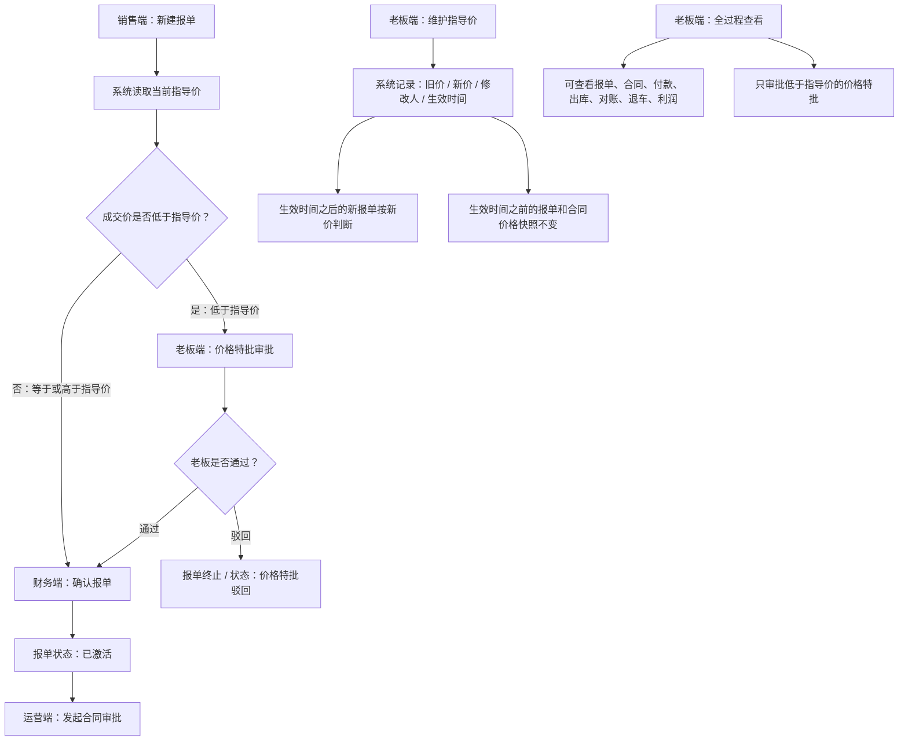
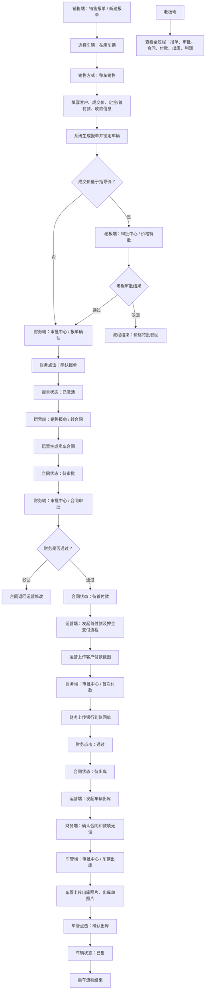
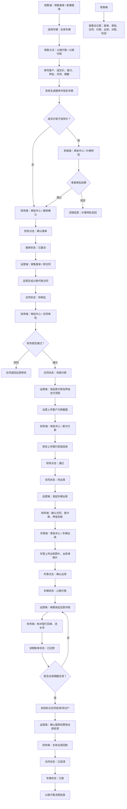

# 金聚源车辆管理系统三类业务工作流

说明：本文档为可编辑版本。每个流程使用 Mermaid 语法编写，可以直接修改节点文字、箭头方向、判断条件，也可以复制到 Mermaid Live Editor、draw.io、飞书文档、语雀等支持 Mermaid 的工具中渲染成流程图。

## 全局规则

```mermaid
flowchart TD
    A["销售端：新建报单"] --> B["系统读取当前指导价"]
    B --> C{"成交价是否低于指导价？"}

    C -- "否：等于或高于指导价" --> D["财务端：确认报单"]
    C -- "是：低于指导价" --> E["老板端：价格特批审批"]

    E --> F{"老板是否通过？"}
    F -- "驳回" --> G["报单终止 / 状态：价格特批驳回"]
    F -- "通过" --> D

    D --> H["报单状态：已激活"]
    H --> I["运营端：发起合同审批"]

    J["老板端：维护指导价"] --> K["系统记录：旧价 / 新价 / 修改人 / 生效时间"]
    K --> L["生效时间之后的新报单按新价判断"]
    K --> M["生效时间之前的报单和合同价格快照不变"]

    N["老板端：全过程查看"] --> O["可查看报单、合同、付款、出库、对账、退车、利润"]
    N --> P["只审批低于指导价的价格特批"]
```

## 卖车流程

```mermaid
flowchart TD
    A["销售端：销售报单 / 新建报单"] --> B["选择车辆：在库车辆"]
    B --> C["销售方式：整车销售"]
    C --> D["填写客户、成交价、定金/首付款、收款信息"]
    D --> E["系统生成报单并锁定车辆"]
    E --> F{"成交价低于指导价？"}

    F -- "否" --> G["财务端：审批中心 / 报单确认"]
    F -- "是" --> H["老板端：审批中心 / 价格特批"]

    H --> I{"老板审批结果"}
    I -- "驳回" --> J["流程结束：价格特批驳回"]
    I -- "通过" --> G

    G --> K["财务点击：确认报单"]
    K --> L["报单状态：已激活"]

    L --> M["运营端：销售报单 / 转合同"]
    M --> N["运营生成卖车合同"]
    N --> O["合同状态：待审批"]

    O --> P["财务端：审批中心 / 合同审批"]
    P --> Q{"财务是否通过？"}
    Q -- "驳回" --> R["合同退回运营修改"]
    Q -- "通过" --> S["合同状态：待首付款"]

    S --> T["运营端：发起首付款及押金支付流程"]
    T --> U["运营上传客户付款截图"]
    U --> V["财务端：审批中心 / 首次付款"]
    V --> W["财务上传银行到账回单"]
    W --> X["财务点击：通过"]
    X --> Y["合同状态：待出库"]

    Y --> Z["运营端：发起车辆出库"]
    Z --> AA["财务端：确认合同和款项无误"]
    AA --> AB["车管端：审批中心 / 车辆出库"]
    AB --> AC["车管上传出库照片、出库单照片"]
    AC --> AD["车管点击：确认出库"]
    AD --> AE["车辆状态：已售"]
    AE --> AF["卖车流程结束"]

    AG["老板端"] --> AH["查看全过程：报单、审批、合同、付款、出库、利润"]
```

## 租车流程

```mermaid
flowchart TD
    A["销售端：销售报单 / 新建报单"] --> B["选择车辆：在库车辆"]
    B --> C["销售方式：经营租赁"]
    C --> D["填写客户、租期、租金、押金、成交价/租赁总价"]
    D --> E["系统生成报单并锁定车辆"]
    E --> F{"成交价低于指导价？"}

    F -- "否" --> G["财务端：审批中心 / 报单确认"]
    F -- "是" --> H["老板端：审批中心 / 价格特批"]

    H --> I{"老板审批结果"}
    I -- "驳回" --> J["流程结束：价格特批驳回"]
    I -- "通过" --> G

    G --> K["财务点击：确认报单"]
    K --> L["报单状态：已激活"]

    L --> M["运营端：销售报单 / 转合同"]
    M --> N["运营生成租赁合同"]
    N --> O["合同状态：待审批"]

    O --> P["财务端：审批中心 / 合同审批"]
    P --> Q{"财务是否通过？"}
    Q -- "驳回" --> R["合同退回运营修改"]
    Q -- "通过" --> S["合同状态：待首付款"]

    S --> T["运营端：发起押金支付流程"]
    T --> U["运营上传客户付款截图"]
    U --> V["财务端：审批中心 / 首次付款"]
    V --> W["财务上传银行到账回单"]
    W --> X["财务点击：通过"]
    X --> Y["合同状态：待出库"]

    Y --> Z["运营端：发起车辆出库"]
    Z --> AA["财务端：确认合同和押金到账"]
    AA --> AB["车管端：审批中心 / 车辆出库"]
    AB --> AC["车管上传出库照片、出库单照片"]
    AC --> AD["车管点击：确认出库"]
    AD --> AE["车辆状态：租赁中"]

    AE --> AF["运营端：每期发起还款对账"]
    AF --> AG["财务端：核对银行回单、流水号"]
    AG --> AH["该期账单状态：已还款"]
    AH --> AI{"是否还有未还期数？"}
    AI -- "有" --> AF
    AI -- "无/租期结束" --> AJ["进入退车流程"]

    AJ --> AK["销售端：车辆管理 / 发起退车"]
    AK --> AL["系统自动带出车辆、客户、合同、银行卡信息"]
    AL --> AM["退车状态：待车管验车"]

    AM --> AN["车管端：退车验工"]
    AN --> AO["车管填写验车信息、工具、损伤、照片"]
    AO --> AP["退车状态：待运营填写"]

    AP --> AQ["运营端：退车验工"]
    AQ --> AR["运营填写租金、违章、ETC、保养、事故等数据"]
    AR --> AS["退车状态：待财务复核"]

    AS --> AT["财务端：退车验工"]
    AT --> AU["财务复核扣款、押金、退款金额、退款账户"]
    AU --> AV["退车状态：待领导审批或待出款"]

    AV --> AW["老板端：领导审批，如需退款确认"]
    AW --> AX["财务端：执行出款"]
    AX --> AY["车管/系统：车辆回库"]
    AY --> AZ["车辆状态：在库 / 二手车"]
    AZ --> BA["租车流程结束"]

    BB["老板端"] --> BC["查看全过程：报单、审批、合同、付款、出库、还款、退车、利润"]
```

## 以租代售流程

```mermaid
flowchart TD
    A["销售端：销售报单 / 新建报单"] --> B["选择车辆：在库车辆"]
    B --> C["销售方式：以租代售 / 以租代购"]
    C --> D["填写客户、成交价、首付、押金、月供、期数"]
    D --> E["系统生成报单并锁定车辆"]
    E --> F{"成交价低于指导价？"}

    F -- "否" --> G["财务端：审批中心 / 报单确认"]
    F -- "是" --> H["老板端：审批中心 / 价格特批"]

    H --> I{"老板审批结果"}
    I -- "驳回" --> J["流程结束：价格特批驳回"]
    I -- "通过" --> G

    G --> K["财务点击：确认报单"]
    K --> L["报单状态：已激活"]

    L --> M["运营端：销售报单 / 转合同"]
    M --> N["运营生成以租代售合同"]
    N --> O["合同状态：待审批"]

    O --> P["财务端：审批中心 / 合同审批"]
    P --> Q{"财务是否通过？"}
    Q -- "驳回" --> R["合同退回运营修改"]
    Q -- "通过" --> S["合同状态：待首付款"]

    S --> T["运营端：发起首付款及押金支付流程"]
    T --> U["运营上传客户付款截图"]
    U --> V["财务端：审批中心 / 首次付款"]
    V --> W["财务上传银行到账回单"]
    W --> X["财务点击：通过"]
    X --> Y["合同状态：待出库"]

    Y --> Z["运营端：发起车辆出库"]
    Z --> AA["财务端：确认合同、首付款、押金到账"]
    AA --> AB["车管端：审批中心 / 车辆出库"]
    AB --> AC["车管上传出库照片、出库单照片"]
    AC --> AD["车管点击：确认出库"]
    AD --> AE["车辆状态：以租代售"]

    AE --> AF["运营端：每期发起还款对账"]
    AF --> AG["财务端：核对银行回单、流水号"]
    AG --> AH["该期账单状态：已还款"]
    AH --> AI{"是否全部期数还清？"}
    AI -- "否" --> AF
    AI -- "是" --> AJ["系统标记合同结清/待过户"]

    AJ --> AK["运营端：确认尾款和费用全部结清"]
    AK --> AL["财务端：复核全部回款"]
    AL --> AM["合同状态：已结清"]
    AM --> AN["车辆状态：已售"]
    AN --> AO["以租代售流程结束"]

    AP["老板端"] --> AQ["查看全过程：报单、审批、合同、付款、出库、对账、利润"]
```

