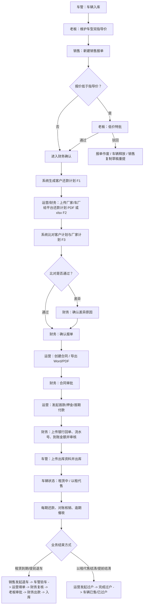
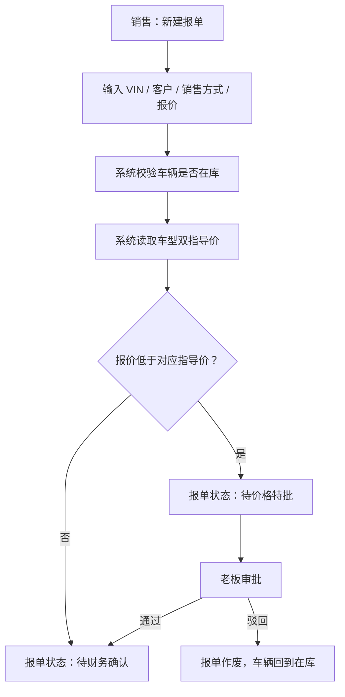
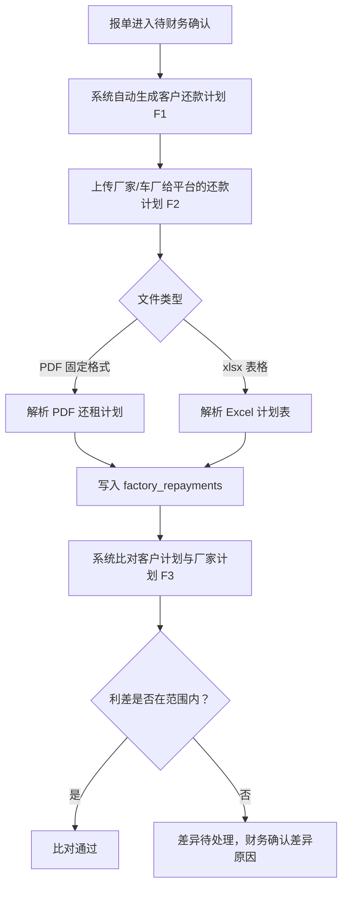
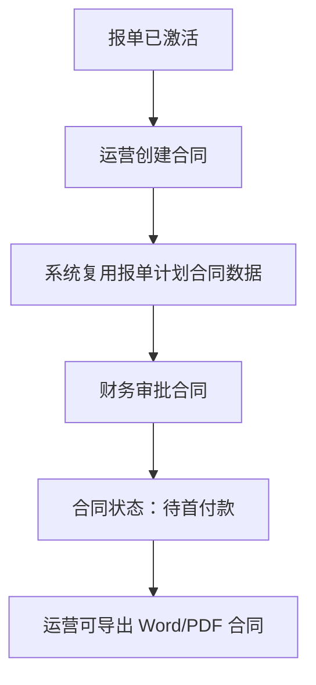
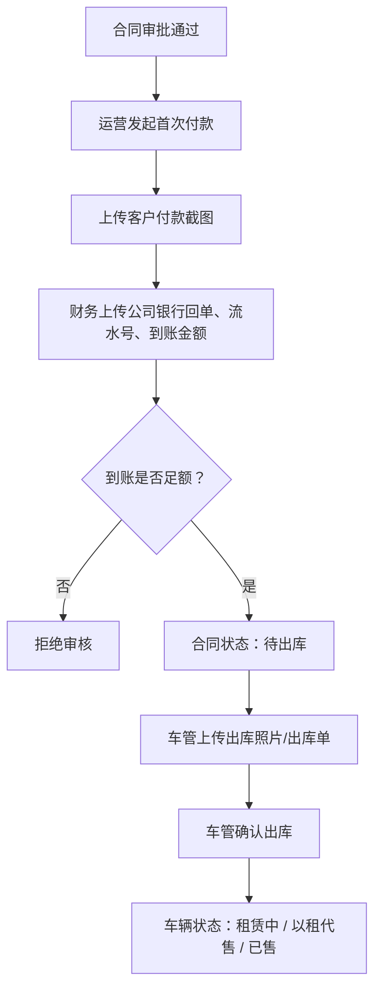
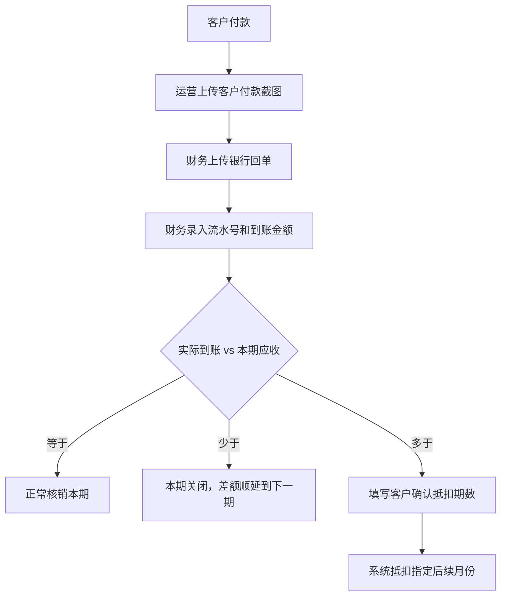
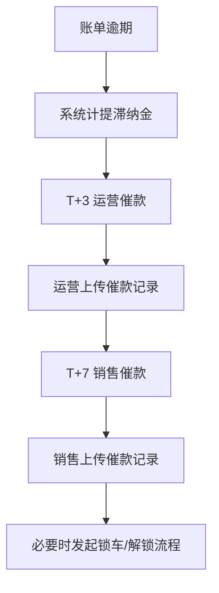
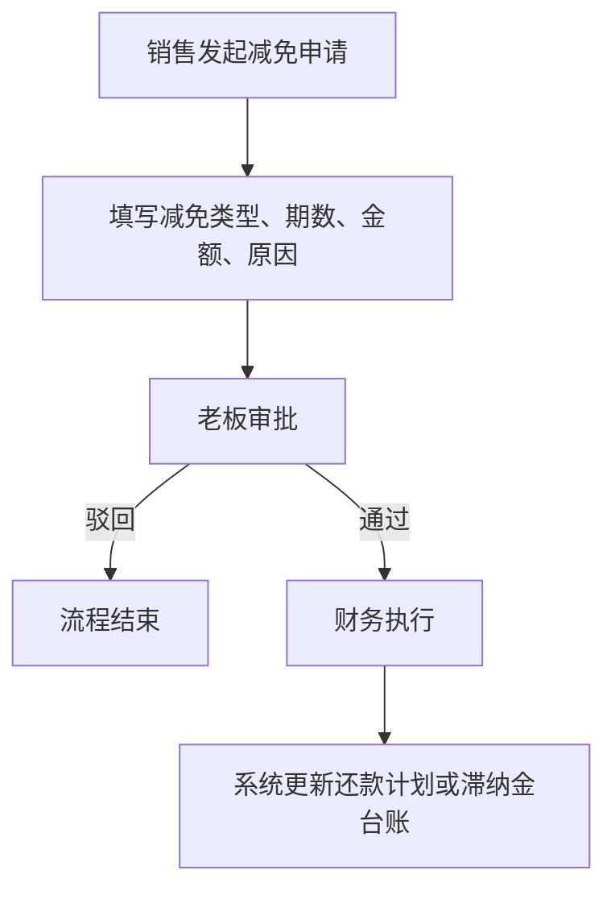
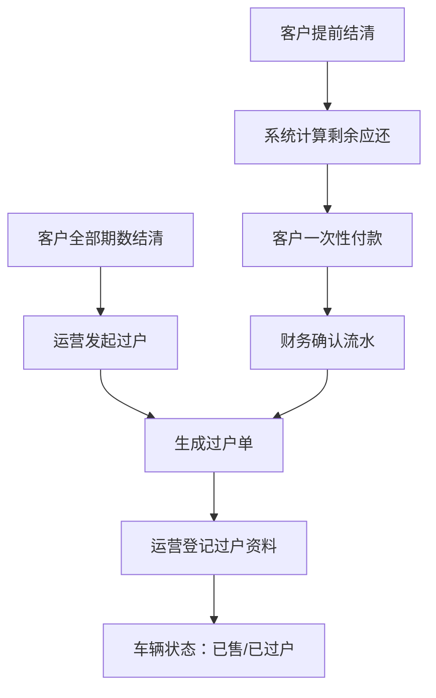
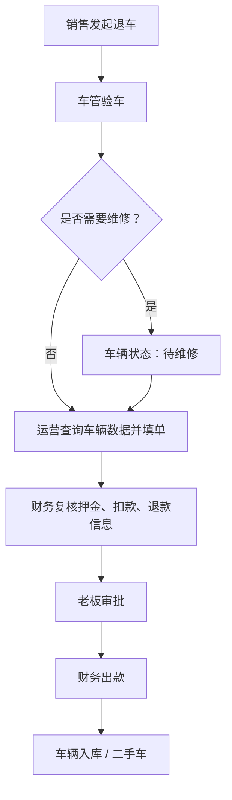

# 金聚源车辆管理系统操作手册（带流程版）

> 适用版本：当前系统实际实现版本  
> 系统地址：http://127.0.0.1:49165  
> 默认密码：`123456`

## 1. 账号与角色

| 账号 | 角色 | 主要职责 |
|---|---|---|
| `boss` | 老板 | 指导价维护、低价特批、经营看板、利润查看、退车领导审批 |
| `sales` | 销售 | 新建销售报单、客户沟通、客户付款截图、催收、退车发起、减免申请 |
| `ops` | 运营 | 合同创建/导出、客户还款截图、厂家计划导入、发票申请、过户、提前结清 |
| `fin` | 财务 | 报单确认、计划比对、银行回单、流水核销、首款审核、费用/返利/利润 |
| `fleet` | 车管 | 车辆入库、出库资料、车辆出库、退车验车、旧车入库 |

## 2. 总业务流程



## 3. 车辆入库

适用角色：`fleet`

### 操作步骤

1. 登录 `fleet`。
2. 进入「车辆管理」。
3. 点击「车辆入库」。
4. 填写车辆基础信息：
   - VIN，必须 17 位且唯一。
   - 车牌号。
   - 车型。
   - 新车/二手车。
   - 发票价、采购价、税率。
   - 保险到期日、年审日期。
   - 发票/合同附件。
5. 点击保存。

### 系统结果

- 车辆状态为「在库」。
- 销售报单时只能选择「在库」车辆。
- 保险/年审日期进入风控预警。

## 4. 指导价维护

适用角色：`boss`

### 规则

系统按车型维护两类指导价：

| 业务 | 指导价口径 | 报单核对字段 |
|---|---|---|
| 经营租赁 | 租赁每期分期指导价 | 每期租金 |
| 以租代售 | 整车指导价 | 整车成交价 |

### 操作步骤

1. 登录 `boss`。
2. 进入「设置」或指导价维护区域。
3. 选择车型。
4. 填写：
   - 租赁每期分期指导价。
   - 以租代售整车指导价。
   - 备注。
5. 保存。

### 系统结果

- 新报单使用最新指导价。
- 已创建的报单/合同保留当时价格快照，不被新价格回写。

## 5. 销售报单

适用角色：`sales`



### 操作步骤

1. 登录 `sales`。
2. 进入「销售报单」。
3. 点击「新建报单」。
4. 填写：
   - 客户姓名、电话。
   - VIN。
   - 销售方式：经营租赁 / 以租代售 / 销售。
   - 起租日、租期或分期数。
   - 租金、押金、首付、整车成交价。
   - 收款公司、业务员、备注。
5. 提交。

### 系统结果

- 车辆状态变为「报单锁定中」。
- 报单进入「待财务确认」或「待价格特批」。
- 如果低于指导价，老板不通过则报单作废，销售可复制为草稿后重新提交。

## 6. F1/F2/F3 还款计划与比对

适用角色：`ops`、`fin`

### 流程



### 客户还款计划 F1

系统自动生成，不需要人工上传。

| 业务 | 客户计划生成规则 |
|---|---|
| 租赁 | 第 1 期从起租日开始，后续按月生成 |
| 以租代售 | 首付款单独记录，分期从次月开始 |

### 厂家/车厂给平台计划 F2

这个计划对应平台对车厂/厂家/车场的应付计划，在系统中写入 `factory_repayments`。

支持两种文件：

| 文件 | 用途 | 说明 |
|---|---|---|
| PDF | 车厂/车场给平台的还款计划表 | 固定识别你提供的 `还款计划FCSSSXJJ00528.pdf` 格式 |
| xlsx | 旧版厂家计划表 | 表头需包含「应还款日期」「客户应还金额合计」 |

### PDF 识别字段

系统会从 PDF 中识别：

- 租赁合同号。
- 承租人姓名。
- 计息本金。
- 租赁期限。
- 主车车牌号。
- 预计每期还租日。
- 每期还款明细：
  - 序号。
  - 应还款日期。
  - 利率。
  - 客户应还本金。
  - 客户应还利息。
  - 贴息。
  - 罚金。
  - 客户应还金额合计。
  - 还款标记：已归还 / 未归还。

PDF 中的「已归还/未归还」会写入备注，例如：`PDF状态:已归还`。后续如果要把车厂侧已付款自动生成实际流水，可以直接用这个字段。

### 操作步骤

1. 登录 `ops` 或 `fin`。
2. 进入「销售报单」或「账单/厂家计划导入」相关区域。
3. 选择对应合同。
4. 点击「上传厂家计划表」。
5. 上传 PDF 或 xlsx。
6. 点击「导入并比对」。

### 系统结果

- 系统清空该合同旧的厂家计划，写入新计划。
- 更新厂家期数。
- 自动执行 F3 比对。
- 比对结果为：
  - 「已通过」：财务可继续确认报单。
  - 「差异待处理」：财务需确认差异原因后继续。
  - 「未上传」：不能财务确认报单。

## 7. 财务确认报单

适用角色：`fin`

### 操作前置

财务确认报单前必须满足：

- 客户还款计划已生成。
- 厂家/车厂给平台计划已上传。
- 计划比对状态为「已通过」或「差异已确认」。
- 如低价报单，老板特批已通过。

### 操作步骤

1. 登录 `fin`。
2. 进入「审批中心」或「销售报单」。
3. 找到「待财务确认」报单。
4. 核对：
   - 客户。
   - VIN / 车牌。
   - 销售方式。
   - 指导价快照。
   - 客户计划总额。
   - 厂家计划总额。
   - 利差。
5. 点击确认。

### 系统结果

- 报单状态变为「已激活」。
- 可进入合同创建。

## 8. 合同创建、导出与审批

适用角色：`ops`、`fin`



### 操作步骤

1. 登录 `ops`。
2. 进入车辆或合同页面。
3. 选择已激活报单对应车辆。
4. 创建合同，核对：
   - 合同类型：租赁 / 以租代售 / 销售。
   - 起租日。
   - 期数。
   - 租金。
   - 押金。
   - 首付。
   - 总价。
   - 收款公司。
5. 保存合同。
6. 财务登录 `fin`，进入「审批中心」，审批合同。
7. 审批通过后，合同进入「待首付款」。

### 合同导出

1. 登录 `ops` 或 `boss`。
2. 找到合同。
3. 点击「导出合同」。
4. 下载 Word 和 PDF。

## 9. 首次付款与出库

适用角色：`ops`、`fin`、`fleet`



### 首款金额口径

| 合同类型 | 默认首款口径 |
|---|---|
| 租赁 | 押金 + 首期租金 |
| 以租代售 | 首付款 |
| 销售 | 总价或首付款 |

### 操作步骤

1. `ops` 发起首次付款。
2. 上传客户付款截图。
3. `fin` 上传公司收款回单。
4. `fin` 填写银行流水号和到账金额。
5. `fin` 审核通过。
6. `fleet` 上传出库照片和出库单。
7. `fleet` 点击确认出库。

### 系统结果

- 租赁：车辆状态变为「租赁中」。
- 以租代售：车辆状态变为「以租代售」。
- 销售：车辆状态变为「已售」。
- 租赁首期租金会自动核销第 1 期客户还款，避免重复入账。

## 10. 每期客户还款与对账核销

适用角色：`ops`、`fin`



### 操作步骤

1. `ops` 进入「对账单」。
2. 找到本期账单。
3. 上传客户付款截图。
4. `fin` 上传银行回单。
5. `fin` 点击「录入流水号」。
6. 填写：
   - 银行流水号，不少于 4 位。
   - 本次到账金额。
   - 如果到账金额大于本期应收，必须填写抵扣期数，例如：`2,3`。
7. 点击确认核销。

### 规则

| 场景 | 系统处理 |
|---|---|
| 按标准还款 | 本期状态为「已还款」，计划不变 |
| 少于标准还款 | 本期状态为「已还款」，差额自动加到下一期 |
| 多于标准还款 | 必须填写抵扣期数，系统把多余金额抵扣到指定后续期 |
| 多还但未填期数 | 系统拒绝核销，提示先确认抵扣月份 |

### 注意事项

- 财务只确认流水真实性和到账金额。
- 多还抵扣哪几期，应由运营与客户先确认。
- 系统会保留抵扣记录和核销明细。

## 11. 逾期、催收与费用抵扣

适用角色：`ops`、`sales`、`fin`

### 日终规则

系统会按还款日期推进状态：

- 还款日前 3 天：临近还款。
- 还款日当天：还款日。
- 逾期后：逾期 N 日。
- 逾期后按万分之 5/日计提滞纳金。

### 催收流程



### 费用抵扣顺序

系统核销时会优先处理费用项：

1. 保险 / 代办类费用。
2. 维修 / 事故 / 罚金类费用。
3. 滞纳金。
4. 本期租金。

## 12. 租金/滞纳金减免

适用角色：`sales`、`boss`、`fin`



### 减免类型

- 租金减免：减少指定期数应收租金。
- 滞纳金减免：减少已计提滞纳金。

### 注意事项

- 以租代售提前结清或过户前，如果存在待审批/已通过未执行的减免，系统会阻止结清/过户。
- 减免必须有原因。

## 13. 发票申请

适用角色：`ops`、`fin`

### 操作步骤

1. `ops` 在合同下发起发票申请。
2. 填写：
   - 金额。
   - 开票主体。
   - 税号。
   - 对应期数。
3. `fin` 开票。
4. `fin` 填写发票号、上传发票文件。

### 异常处理

- 发票可红冲。
- 红冲后可重新提交。

## 14. 利润核算与累计盈亏

适用角色：`fin`、`boss`

### 数据来源

| 数据 | 来源 |
|---|---|
| 客户侧应收计划 | `repayments` |
| 客户侧实际回款 | `repayments.paid_amount` / 核销流水 |
| 车厂/厂家侧应付计划 | `factory_repayments`，由 PDF 或 xlsx 导入 |
| 车厂/厂家侧实际已付 | `factory_repayments.status='已还款'` |
| 费用项 | `contract_fee_items` |
| 返利 | `vehicle_rebates` |
| 采购价/残值 | 车辆资产表 |

### 核算口径

```text
计划单车毛利 = 客户还款计划总额 - 厂家/车厂还款计划总额
实际现金利润 = 客户实际回款 - 厂家/车厂实际付款 + 车辆返利
含资产净值口径 = 实际现金利润 + 车辆预计残值 - 车辆采购价
```

### 操作步骤

1. 登录 `fin` 或 `boss`。
2. 进入「利润核算」。
3. 查看：
   - 客户计划总额。
   - 厂家计划总额。
   - 客户已收。
   - 厂家已付。
   - 返利。
   - 计划毛利。
   - 现金利润。
   - 含资产净值口径。

### 使用建议

- 想看“当前真实流水差额”，重点看现金利润。
- 想看“这台车最终理论能赚多少”，看计划单车毛利。
- 想考虑车辆还在手里的资产价值，看含资产净值口径。

## 15. 以租代售结清与过户

适用角色：`ops`、`fin`



### 自然结清过户

1. 确认所有客户分期均已结清。
2. `ops` 发起过户。
3. 填写过户日期、新车主信息、过户文件。
4. 完成过户。

### 提前结清

1. `ops` 进入合同提前结清。
2. 系统计算剩余分期、费用、已审批减免、预收抵扣。
3. 客户付款。
4. `fin` 填写流水号、到账金额。
5. 系统核销剩余应还并生成过户单。

## 16. 租赁退车与旧车入库

适用角色：`sales`、`fleet`、`ops`、`fin`、`boss`



### 操作步骤

1. `sales` 发起退车。
2. `fleet` 验车，填写：
   - 随车工具。
   - 证件钥匙。
   - 里程。
   - 事故、违章、维修、ETC。
   - 是否需要维修。
3. `ops` 填写车辆相关数据。
4. `fin` 复核：
   - 应扣款项。
   - 应退押金。
   - 收款账户。
5. `boss` 审批。
6. `fin` 出款。
7. 车辆回到「在库」，类型为「二手车」。

## 17. 常见问题

### 17.1 厂家 PDF 上传失败怎么办？

检查 PDF 是否为固定格式：

- 必须能复制文本，不支持纯扫描图片。
- 明细行应包含：序号、日期、利率、本金、利息、贴息、罚金、金额合计、还款标记。
- 如果是扫描件，需要先转换成可识别文本 PDF。

### 17.2 报单无法财务确认？

通常是以下原因：

- 还没有上传厂家/车厂给平台计划。
- F3 比对为「差异待处理」但未确认差异。
- 报价低于指导价但老板还没通过。
- 报单已作废或状态不正确。

### 17.3 多还款无法核销？

多还款必须填写抵扣期数，例如 `3,4`。系统不允许财务直接决定抵扣月份，需要运营和客户先确认。

### 17.4 为什么 PDF 里的“已归还”没有直接变成已付款？

当前实现先把 PDF 计划作为厂家/车厂侧计划导入，PDF 原始状态写入备注。后续如果要把“已归还”自动转成厂家侧实付流水，可以基于 `remark` 中的 `PDF状态:已归还` 做自动核销。

### 17.5 利润为什么和现金余额不完全一致？

利润核算有多个口径：

- 计划毛利看未来总账。
- 现金利润看当前已收已付。
- 含资产净值口径还会考虑车辆采购价和预计残值。

因此同一台车在不同阶段看起来会有不同结果，这是正常的。

