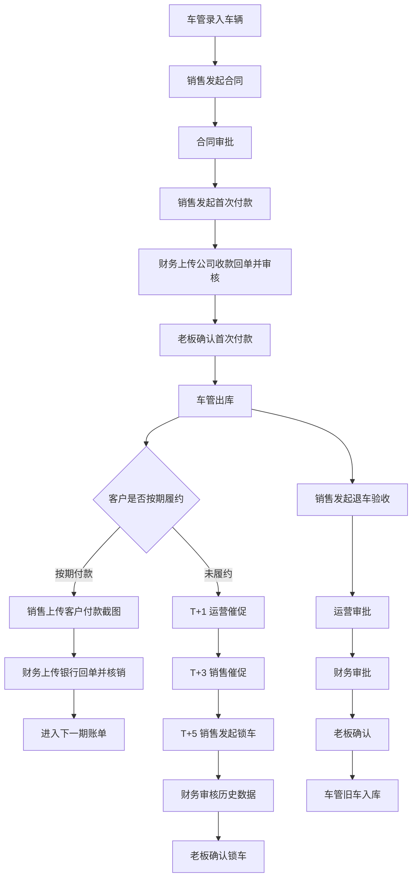

# 金聚源车辆管理系统操作手册

## 1. 适用范围

本手册按《解放车辆流程图3.pdf》梳理，覆盖车辆从入库、签约、首次付款、出库、还款对账、逾期锁车到退车入库的完整业务闭环。

系统地址：

- [http://127.0.0.1:49165](http://127.0.0.1:49165)

默认测试账号，密码均为 `123456`：

- `boss`：老板
- `ops`：运营
- `legal`：法务
- `fin`：财务
- `fleet`：车管
- `sales`：销售

## 2. 总流程



## 3. 车辆入库

适用角色：`车管`

操作步骤：

1. 登录 `fleet`。
2. 进入“车辆管理”。
3. 点击右上角“车辆入库”。
4. 录入 VIN、车牌号、车型、上户公司、发票日期、发票价、指导价等信息。
5. 提交保存。

预期结果：

- 车辆出现在车辆列表。
- 车辆状态为“在库”。
- 全员可在资产或合同发起时查看车辆基础信息。

## 4. 合同发起与审批

适用角色：`销售 -> 运营 -> 财务 -> 法务 -> 老板`

适用合同：

- 租赁
- 以租代售
- 销售 / 卖车

操作步骤：

1. 销售登录 `sales`。
2. 进入“合同管理”，点击“新建合同”。
3. 输入 VIN，系统自动匹配在库车辆。
4. 填写客户姓名、电话、合同类型、合同起始日、期数、租金、月供、押金、首付、售价等信息。
5. 上传合同附件后提交。
6. 运营登录 `ops`，进入“审批中心”，通过合同审批。
7. 财务登录 `fin`，进入“审批中心”，通过合同审批。
8. 法务登录 `legal`，进入“审批中心”，通过合同审批。
9. 老板登录 `boss`，进入“审批中心”，通过合同审批。

预期结果：

- 合同创建后状态为“待审批”。
- 审批中状态变为“审批中”。
- 合同审批全部通过后，交付状态必须变为“待首付款”。
- 此时车管不能直接出库，必须先完成首次付款审核。

## 5. 首次付款流程

适用角色：`销售 -> 财务 -> 老板`

适用合同：

- 租赁：押金及首次支付金额
- 以租代售：押金、首付及首次支付金额
- 销售 / 卖车：车辆支付金额

操作步骤：

1. 销售登录 `sales`。
2. 进入“合同管理”。
3. 找到交付状态为“待首付款”或“首付已驳回”的合同。
4. 点击“发起首次付款”。
5. 确认付款类型和金额。
6. 上传客户付款截图。
7. 提交首次付款。
8. 财务登录 `fin`。
9. 进入“审批中心”，筛选“首次付款”。
10. 上传公司收款回单或银行到账截图。
11. 点击“通过”完成财务审核。
12. 老板登录 `boss`。
13. 进入“审批中心”，通过首次付款确认。

预期结果：

- 未上传客户付款截图时，销售不能提交首次付款。
- 未上传公司收款回单时，财务不能通过审核。
- 老板确认后，合同交付状态变为“待出库”。
- 租赁和以租代售的首期租金会自动核销第 1 期客户还款，避免后续重复入账。
- 押金和首付状态会同步更新为“已收”。

## 6. 车辆出库

适用角色：`车管`

操作步骤：

1. 车管登录 `fleet`。
2. 进入“审批中心”或“车辆管理”。
3. 找到交付状态为“待出库”的车辆。
4. 点击“确认出库”。

预期结果：

- 租赁合同出库后车辆状态为“租赁中”。
- 以租代售合同出库后车辆状态为“以租代售”。
- 销售合同出库后车辆状态为“已售”，合同状态变为“已结清”。
- 如果合同仍处于“待审批”“待首付款”“首付审批中”等状态，系统会阻止出库。

## 7. 客户还款对账

适用角色：`销售 -> 财务`

操作步骤：

1. 销售登录 `sales`。
2. 进入“对账单”。
3. 找到客户当期账单，上传客户付款截图。
4. 财务登录 `fin`。
5. 进入“对账单”。
6. 上传银行回单或公司到账截图。
7. 录入银行流水号，至少 4 位。
8. 点击确认核销。

预期结果：

- 对账进度依次完成：客户截图 -> 银行回单 -> 流水号 -> 已核销。
- 对应还款记录变为“已还款”。
- 合同已收租金增加。
- 已核销账单不能重复核销。
- 所有对账发起都统一由销售完成，运营不再作为对账发起角色。

## 8. 厂家月供确认

适用角色：`财务`

操作步骤：

1. 财务登录 `fin`。
2. 进入“合同管理”。
3. 展开合同明细。
4. 切换到“厂家月供（公司->解放）”。
5. 对实际已支付的一期点击“核销”。

预期结果：

- 厂家月供记录变为“已还款”。
- 合同已付本金增加。
- 同一期厂家月供不能重复核销。

## 9. 逾期催促与锁车

适用角色：`运营 -> 销售 -> 财务 -> 老板`

操作步骤：

1. 系统识别逾期账单后，在“锁车管理”展示。
2. T+1 时运营登录 `ops`，点击“已催促”。
3. T+3 时销售登录 `sales`，点击“已催促”。
4. 如果催促后客户付款，回到“客户还款对账”流程。
5. 如果仍未付款，T+5 后销售点击“发起锁车”。
6. 财务登录 `fin`，审核历史数据。
7. 老板登录 `boss`，确认锁车。

预期结果：

- 系统只做逾期标记，不会绕过审批自动锁车。
- 锁车必须经过财务和老板审批。
- 审批通过后车辆状态变为“已锁车”。

## 10. 退车验收与旧车入库

适用角色：`销售 -> 运营 -> 财务 -> 老板 -> 车管`

操作步骤：

1. 销售登录 `sales`。
2. 进入“退车验工”。
3. 新建退还车辆验收单。
4. 填写退租原因、车辆信息、随车工具、证件、里程、事故、违章、维修、扣款、退款等信息。
5. 保存后点击“提交审批”。
6. 运营登录 `ops`，审批通过。
7. 财务登录 `fin`，审批通过。
8. 老板登录 `boss`，确认通过。
9. 车管登录 `fleet`，点击“确认入库”。

预期结果：

- 验收单状态依次为“已登记 -> 待审批 -> 待入库 -> 已入库”。
- 车辆状态回到“在库”。
- 车辆类型变为“二手车”。
- 原合同状态变为“已结清”。

## 11. 常见异常处理

- 合同被驳回：销售或老板可在审批中心点击“重新提交”。
- 首次付款被驳回：销售重新发起首次付款并重新上传凭证。
- 财务无法通过首次付款：先检查是否已上传公司收款回单。
- 车管无法出库：检查合同是否已完成首次付款审核并进入“待出库”。
- 对账无法核销：检查客户截图、银行回单、流水号是否完整。
- 锁车无法发起：检查是否已达到 T+5，且是否为销售账号操作。

## 12. 测试命令

编译检查：

```bash
PYTHONPYCACHEPREFIX=/private/tmp/codex-pycache python3 -m py_compile app.py database.py tests/test_full_flow.py
```

全流程自动化测试：

```bash
python3 -m unittest -v tests.test_full_flow
```

当前已通过 `5/5` 条端到端测试。
