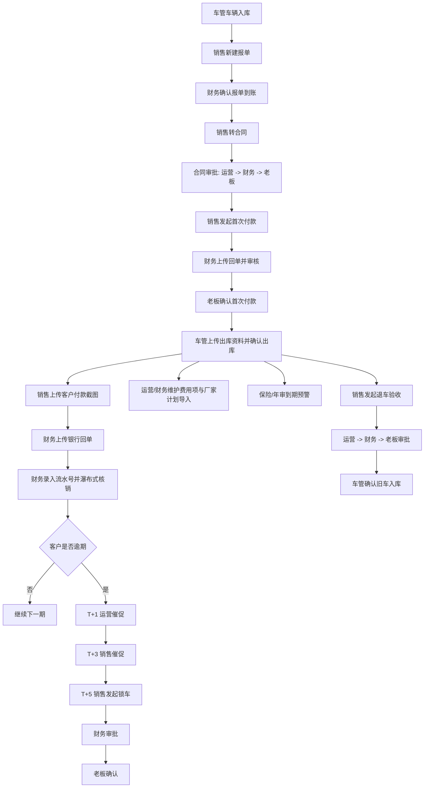

# 金聚源车辆管理系统操作手册

## 1. 文档说明

本手册基于当前项目实际可用版本编写，结合最新 PRD、全链路流程图、合同样本、还款计划表整理，覆盖以下业务主线：

- 销售报单
- 车辆入库
- 合同创建与审批
- 首次付款审批
- 出库交付
- 客户对账核销
- 厂家还款计划导入
- 保险/年审预警
- 逾期催收与锁车
- 退车验收与旧车入库

系统地址：

- [http://127.0.0.1:49165](http://127.0.0.1:49165)

默认账号，密码统一为 `123456`：

- `boss`：老板
- `ops`：运营
- `fin`：财务
- `fleet`：车管
- `sales`：销售

## 2. 总流程


```mermaid
flowchart TD
    A["车管车辆入库"] --> B["销售新建报单"]
    B --> C["财务确认报单到账"]
    C --> D["销售转合同"]
    D --> E["合同审批: 运营 -> 财务 -> 老板"]
    E --> F["销售发起首次付款"]
    F --> G["财务上传回单并审核"]
    G --> H["老板确认首次付款"]
    H --> I["车管上传出库资料并确认出库"]
    I --> J["销售上传客户付款截图"]
    J --> K["财务上传银行回单"]
    K --> L["财务录入流水号并瀑布式核销"]
    I --> M["运营/财务维护费用项与厂家计划导入"]
    I --> N["保险/年审到期预警"]
    L --> O{"客户是否逾期"}
    O -->|否| P["继续下一期"]
    O -->|是| Q["T+1 运营催促"]
    Q --> R["T+3 销售催促"]
    R --> S["T+5 销售发起锁车"]
    S --> T["财务审批"]
    T --> U["老板确认"]
    I --> V["销售发起退车验收"]
    V --> W["运营 -> 财务 -> 老板审批"]
    W --> X["车管确认旧车入库"]
```

## 3. 角色分工

- 销售：新建报单、转合同、上传客户付款截图、发起首次付款、催收、发起锁车、发起退车验收。
- 财务：确认报单到账、上传银行回单、录入流水号核销、维护费用项、导入厂家计划、审批锁车、审批首次付款。
- 运营：合同审批、查看逾期、导入厂家计划、T+1 催促、审批退车入库。
- 老板：指导价调整、首次付款确认、锁车确认、退车入库确认。
- 车管：车辆入库、维护保险/年审字段、上传出库资料、确认出库、确认旧车入库。

## 4. 标准操作流程

### 4.1 车辆入库

适用角色：`fleet`

操作步骤：

1. 登录 `fleet`。
2. 进入“车辆管理”。
3. 点击右上角“车辆入库”。
4. 填写车辆信息：
   - VIN
   - 车牌号
   - 车型
   - 新车/二手车
   - 发票价
   - 开票日期
   - 发动机号
   - 保险到期日
   - 年审日期
5. 如有发票、合同、车辆资料，可一并上传附件。
6. 点击“确认入库”。

系统结果：

- 车辆进入资产列表。
- 状态默认为“在库”。
- 保险和年审日期会进入后续预警列表。

### 4.2 销售报单

适用角色：`sales`

这是最新 PRD 要求的业务入口。

操作步骤：

1. 登录 `sales`。
2. 进入“销售报单”。
3. 点击“新建报单”。
4. 填写：
   - 交款日期
   - 客户姓名
   - 客户电话
   - 销售方式：整车销售 / 以租代购 / 经营租赁
   - VIN
   - 定金金额
   - 微信私收项
   - 赠送项目
   - 是否全包
   - 备注
5. 点击“提交报单”。

系统结果：

- 系统按 VIN 匹配库存车辆。
- 如果该 VIN 已有未结清合同，系统禁止重复报单。
- 报单创建成功后，车辆状态变为“报单锁定中”。
- 报单状态初始为“待财务确认”。

### 4.3 财务确认报单到账

适用角色：`fin`

操作步骤：

1. 登录 `fin`。
2. 进入“销售报单”。
3. 找到状态为“待财务确认”的报单。
4. 点击“确认到账”。

系统结果：

- 报单状态变为“已激活”。
- 销售可以基于该报单直接转合同。

### 4.4 从报单转合同

适用角色：`sales`

操作步骤：

1. 登录 `sales`。
2. 进入“销售报单”。
3. 找到“已激活”的报单。
4. 点击“转合同”。
5. 系统会自动带出：
   - VIN
   - 车辆信息
   - 客户姓名
   - 客户电话
   - 销售方式映射的合同类型
   - 已收定金
6. 补充合同字段：
   - 合同类型
   - 起始日
   - 期数
   - 押金
   - 首付
   - 客户贷款额度
   - 每期客户租金
   - 厂家月供
   - 厂家分期期数
   - 售价/总价
   - 公司、车场
   - 合同附件
7. 点击“确认创建”。

系统结果：

- 报单状态变为“已转合同”。
- 新合同进入合同审批流程。

### 4.5 合同审批

适用角色：`ops -> fin -> boss`

审批顺序：

1. 运营
2. 财务
3. 老板

操作步骤：

1. 对应角色登录系统。
2. 进入“审批中心”。
3. 找到类型为“合同审批”的审批卡片。
4. 点击“通过”或“驳回”。
5. 如驳回，必须填写驳回原因。

系统结果：

- 通过后进入下一审批节点。
- 全部通过后，合同交付状态变为“待首付款”。
- 被驳回后，销售可在审批中心点击“重新提交”。

### 4.5.1 合同自动填充导出 Word/PDF

适用角色：仅 `ops` 和 `boss` 可导出，建议由运营复核后使用。

说明：

- 系统已内置 3 份合同模板：车辆买卖合同、车辆租赁合同、以租代购合同。
- 合同类型为“销售”时使用车辆买卖合同模板。
- 合同类型为“租赁”时使用车辆租赁合同模板。
- 合同类型为“以租代售”时使用以租代购合同模板。
- 运行环境已安装 `python-docx`、`reportlab` 时，系统优先按原始合同模板填充 Word，并同步生成 PDF。
- 如果运行环境缺少上述库，系统会自动生成包含关键字段的兜底 Word/PDF，保证流程不中断；正式签署前建议安装 `requirements.txt` 后重新导出模板版合同。

操作步骤：

1. 登录系统。
2. 进入“车辆管理”。
3. 在车辆/合同列表找到对应合同。
4. 点击“导出合同”。
5. 系统生成后会弹出下载入口：
   - 下载 Word 合同
   - 下载 PDF 合同
6. 下载后重点核对：
   - 合同编号
   - 客户姓名、电话、身份证号
   - VIN / 车架号
   - 车型、车牌号
   - 起租日期 / 合同开始日期
   - 租金、押金、首付、总价、贷款金额
   - 每月还款日

系统结果：

- 导出的文件会保存在项目目录 `contract_templates/generated/`。
- 原始模板文件保存在项目目录 `contract_templates/raw/`。
- 导出动作会写入审计日志。

### 4.6 首次付款审批

适用角色：`sales -> fin -> boss`

适用合同：

- 租赁
- 以租代售
- 销售

操作步骤：

1. 销售登录 `sales`。
2. 进入“审批中心”。
3. 发起首次付款。
4. 选择一条交付状态为“待首付款”或“首付已驳回”的合同。
5. 系统会自动带出默认金额：
   - 销售合同：默认取总价或首付
   - 租赁/以租代售：默认取押金 + 首付 + 首期租金
6. 上传客户付款截图。
7. 提交首次付款。
8. 财务登录 `fin`，进入“审批中心”。
9. 对应首次付款记录上传公司收款回单。
10. 财务审批通过。
11. 老板登录 `boss`，完成最终确认。

系统结果：

- 合同状态从“待首付款”进入“首付审批中”。
- 财务未上传回单时无法通过。
- 老板确认后，合同交付状态变为“待出库”。
- 租赁/以租代售场景下，首期租金会自动核销第 1 期客户账单，避免重复核销。
- 押金和首付状态会同步更新。

### 4.7 车辆出库

适用角色：`fleet`

操作步骤：

1. 登录 `fleet`。
2. 进入“审批中心”或“车辆管理”。
3. 找到交付状态为“待出库”的合同/车辆。
4. 点击“确认出库”。
5. 在出库弹窗中上传：
   - 出库照片
   - 出库单照片
6. 先保存资料，再点击“确认出库”。

系统结果：

- 没有上传出库照片和出库单时，系统不允许出库。
- 出库后车辆状态变化：
  - 销售合同：`已售`
  - 租赁合同：`租赁中`
  - 以租代售合同：`以租代售`
- 销售合同出库后会自动结清。

### 4.8 厂家还款计划导入

适用角色：`ops`、`fin`

说明：

- 当前导入器支持 `xlsx`。
- 已按你现有还款计划表样式适配“应还款日期”等表头。
- 如果金额列为空，系统会回退使用合同中的厂家月供。

操作步骤：

1. 登录 `ops` 或 `fin`。
2. 进入“账单管理”。
3. 在“厂家计划导入与瀑布费用项”区域选择合同。
4. 上传厂家还款计划表。
5. 点击“导入计划”。

系统结果：

- 系统重建该合同的厂家还款计划。
- 合同期数会同步更新为导入期数。

### 4.9 维护保险/维修/罚金等费用项

适用角色：`ops`、`fin`

说明：

- 这部分用于支持最新版 PRD 的“瀑布式核销”。
- 财务到账后，系统会先冲这些费用，再冲租金。

操作步骤：

1. 登录 `ops` 或 `fin`。
2. 进入“账单管理”。
3. 在“查看费用项合同”中选择合同。
4. 点击“新增费用项”。
5. 填写：
   - 费用类型
   - 应收金额
   - 到期日
   - 费用说明
6. 点击“保存费用项”。

支持的费用类型：

- 保险上浮/保费
- 代办杂费
- 维修费用
- 事故费用
- 违章罚金
- 逾期滞纳金

### 4.10 客户对账与瀑布式核销

适用角色：`sales -> fin`

操作步骤：

1. 销售登录 `sales`。
2. 进入“对账单”。
3. 找到客户账单，上传客户付款截图。
4. 财务登录 `fin`。
5. 上传银行回单。
6. 点击“录入流水号”。
7. 输入：
   - 本次到账金额
   - 银行流水号
8. 点击“确认核销”。

系统分配顺序：

1. 保险/代办
2. 维修/事故/罚金
3. 滞纳金
4. 本期租金

系统结果：

- 若到账金额不足，系统会优先冲高优先级费用。
- 若租金未冲满，账单状态会变为“部分核销”或“逾期”。
- 若全部冲满，账单状态变为“已还款”。
- 已核销账单不能重复提交。

### 4.11 保险 / 年审预警

适用角色：全部可见，重点由车管/运营跟进

操作步骤：

1. 进入“锁车管理”。
2. 查看“保险 / 年审预警”列表。
3. 关注 30 天内到期车辆。
4. 回到“车辆管理”更新车辆保险到期日和年审日期。

系统结果：

- 30 天内到期的车辆会进入提醒列表。
- 仪表盘会汇总预警数量。

### 4.12 逾期催促与锁车

适用角色：`ops -> sales -> fin -> boss`

操作步骤：

1. 系统会自动识别逾期账单。
2. 运营登录 `ops`，对 T+1 的账单执行催促记录。
3. 销售登录 `sales`，对 T+3 的账单执行催促记录。
4. 如果客户仍未付款，销售在 T+5 后点击“申请锁车”。
5. 财务登录 `fin`，审批锁车。
6. 老板登录 `boss`，最终确认。

系统结果：

- 锁车申请不会自动执行，必须经过审批。
- 审批通过后，车辆状态变为“已锁车”。

### 4.13 退车验收与旧车入库

适用角色：`sales -> ops -> fin -> boss -> fleet`

操作步骤：

1. 销售登录 `sales`。
2. 进入“退车验工”。
3. 新建退还车辆验收单。
4. 填写：
   - 退租原因
   - 基本车辆信息
   - 工具、证件
   - 里程
   - 事故/违章/ETC/维修情况
   - 滞纳金
   - 扣款
   - 应退金额
5. 点击“保存验收单”。
6. 点击“提交审批”。
7. 运营、财务、老板依次审批通过。
8. 车管登录 `fleet`，点击“确认入库”。

系统结果：

- 状态流转：`已登记 -> 待审批 -> 待入库 -> 已入库`
- 车辆状态恢复为“在库”
- 车辆类型更新为“二手车”
- 原合同变为“已结清”

## 5. 一次完整演示建议

如果你要现场演示，建议按下面顺序走：

1. 用 `fleet` 新建一台车。
2. 用 `sales` 新建报单。
3. 用 `fin` 确认报单到账。
4. 用 `sales` 从报单转合同。
5. 在“车辆管理”中点击“导出合同”，下载 Word/PDF 并核对合同字段。
6. 用 `ops -> fin -> boss` 走完合同审批。
7. 用 `sales` 发起首次付款。
8. 用 `fin` 上传收款回单并审批。
9. 用 `boss` 确认首次付款。
10. 用 `fleet` 上传出库资料并出库。
11. 用 `ops` 或 `fin` 导入厂家还款计划。
12. 用 `fin` 先补一个保险费或维修费费用项。
13. 用 `sales` 上传客户付款截图。
14. 用 `fin` 上传银行回单并录入到账金额，观察瀑布式核销结果。
15. 如需风控演示，把某一期应还日期手动改早，再走催收和锁车。
16. 如需闭环演示，再新建退车验收单并走入库审批。

## 6. 常见问题

- 找不到 VIN：先确认车辆已由车管入库。
- VIN 不能报单：说明该车已有未结清合同或已有进行中报单。
- 合同不能发起首次付款：说明合同审批还没走到“待首付款”。
- 财务无法通过首次付款：先上传公司收款回单。
- 不能出库：先检查是否已完成首次付款审核，并且出库资料是否齐全。
- 厂家计划导入失败：请使用 `xlsx`，并确保表里有“应还款日期”表头。
- 合同导出不是原模板格式：说明当前 Python 环境缺少 `python-docx` 或 `reportlab`，系统已生成兜底版本；安装 `requirements.txt` 后重新导出即可。
- 核销结果和到账不一致：系统会优先冲保险、维修、罚金、滞纳金，最后才是租金。
- 锁车申请失败：必须是销售账号，且逾期达到 T+5。

## 7. 建议的后续增强

当前系统已经能走通主业务流程，但如果你要正式交付，建议下一步继续补：

- 还款分配明细可视化展示
- 费用项编辑/作废
- 全包报单下的重复费用自动拦截
- 锁车执行截图回传
- Excel 批量车辆入库
- 厂家计划 `csv` 导入支持
- 旧版 `xls` 导入支持

## 8. 验证命令

端到端测试：

```bash
python3 -m unittest tests.test_full_flow.py
```

当前结果：

- `7/7` 测试通过
