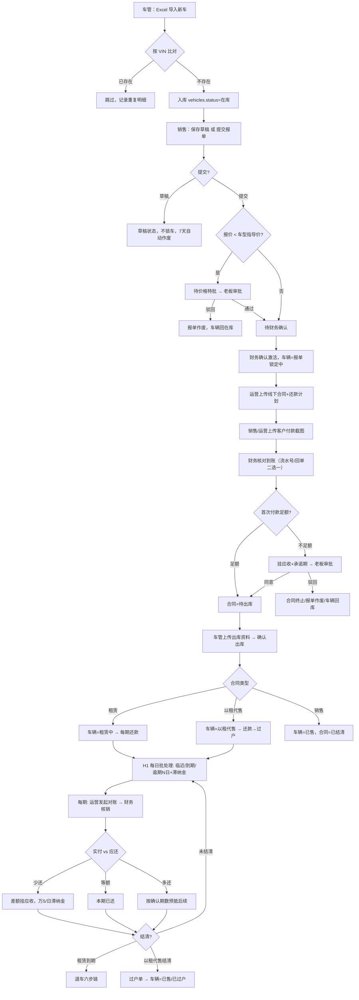

# 金聚源车辆管理系统 · 整体流程文档

- **版本**：v20260803（含 8-01 指导价改版、8-02 尾号字段、8-03 回单可选改动）
- **核对基准**：当前工作区代码 app.py / database.py / templates/index.html（未提交改动已纳入）
- **核对方式**：代码逐段核对，附 `文件:行号` 证据
- **维护说明**：改业务规则时请同步更新本文档及 `workflows/*.mmd` 流程图

---

## 一、整体流程总览



## 二、角色与职责

| 角色 | 主要职责 |
|---|---|
| 车管 | 车辆入库、出库、退车验车、执行锁车 |
| 销售 | 报单（草稿/提交）、客户付款截图、每期对账发起、退车登记、催收、发起减免/锁车 |
| 运营 | 上传线下合同、维护还款计划、发起首次付款、每期对账发起、登记过户、发起发票申请 |
| 财务 | 确认报单、核对首付款到账、核销每期还款、上传回单、退车复核、退款出款、执行减免、开票/红冲 |
| 老板 | 价格特批、首次付款不足审批、退车领导审批、减免审批、发票审批、锁车审批 |

## 三、主流程分段详解

### ① 车辆入库（车管）

- 车管上传新车 Excel（[import_vehicles](app.py#L2931)）→ 系统按 **VIN 全库比对**：
  - 已存在 → 跳过，不重复入库，记录导入结果；
  - 不存在 → 写入 `vehicles.status=在库`。
- 导入完成展示新增/重复/失败明细。
- 车辆字典校验：`car_type` 必须与 `model_guidance_prices` 车型精确匹配（[validate_vehicle_dict](app.py#L305)），无效车型拦截报单并提供修正入口。

### ② 销售报单（销售）

- **保存草稿**：`order_status=草稿`，不锁车，**7 天自动作废**（[expire_sales_order_drafts](app.py#L331)）。
- **提交报单**（[create_sales_order](app.py#L3935)）：校验车辆在库、无进行中报单（锁车）、客户黑名单 → 进入价格校验。

### ③ 价格校验与特批（8-01 改版后的真实规则）

- 指导价来源：车型指导价表 `model_guidance_prices`（[resolve_guidance_prices_for_vehicle](app.py#L231)）：
  - 租赁 → 比对 `lease_installment_price`（租赁月供指导价）；
  - 以租代售 / 销售 → 比对 `sale_total_price`（整车指导价）。
- **触发老板价格特批条件**（[create_sales_order](app.py#L3948)）：非草稿 且（报价 < 对应指导价 或 缺指导价）。
- 状态流转：`待价格特批 →（老板通过）→ 待财务确认`；驳回 → 报单作废、车辆回在库。
- 财务确认激活（[activate_sales_order](app.py#L4297)）：`已激活` + `vehicles.status=报单锁定中`；租赁/以租代售激活前要求先生成客户还款计划（[sales_order_plan_activation_blocker](app.py#L1432)）。

> ⚠️ 注意：**比例口径已整体移除**。8-01 改版删除了「首付/押金比例、每期还款比例 ≥ 老板指导口径」的判断，现在只比「报价 vs 指导价」。另外**整车销售目前也走价格特批**（[normalize_sales_mode](app.py#L218) 归一为「销售」），是否应豁免待业务确认。

### ④ 合同与首次付款（运营 / 财务）

1. **运营上传线下签署合同**（[add_contract](app.py#L4490)）：`contract_status=执行中`、`delivery_status=待首付款`、`contract_file` 必填；同一辆车不能重复签约（历史「报单计划中」壳合同可复用）。
2. 运营**发起首次付款**（[create_initial_payment](app.py#L5955)）：上传客户付款截图 → 生成 `initial_payment` 审批流（财务审核收款）。
3. 财务**核对到账**（[upload_initial_payment_receipt](app.py#L6031)）：填写公司实际到账金额 + **银行流水号（≥4位）或公司回单，二选一即可**（8-03 改动，回单不再强制）。
4. 金额核对（[finalize_initial_payment](app.py#L538)）：
   - **足额** → 合同 `待出库`、押金/首付置已收；
   - **不足额** → 自动挂应收 `initial_payment_shortfall`（[app.py:653](app.py#L653)）→ 承诺期内不计滞纳金、超期按万5/日计提 → **老板审批是否允许不足额出库**（[initial_payment_shortage](app.py#L7096)）：
     - 同意 → 差额保留为应收，允许出库；
     - 驳回 → 合同终止、报单作废、车辆回在库（**退款执行环节缺失，见遗留问题**）。

### ⑤ 出库（车管）

- 车管上传**出库照片 + 出库单照片**（必填，[deliver_vehicle](app.py#L7703)）→ 确认出库：
  - 租赁 → `车辆=租赁中`；
  - 以租代售 → `车辆=以租代售`；
  - 销售 → `车辆=已售` 且合同直接 `已结清`。

### ⑥ 每期还款与对账（销售/运营 + 财务）

- 运营**发起对账**：填写客户实付金额 + 上传支付凭证截图（[upload_screenshot](app.py#L5717)）。
- 财务**核销**（[confirm_repayment](app.py#L4829)），按瀑布分配（[apply_waterfall_allocation](app.py#L911)）：
  - **等额** → 本期已还款；
  - **多还** → 必须指定抵扣期数；整期覆盖=`已还款`、部分覆盖=`预抵`（差额后续可补足）；多还超上限拦截；
  - **少还** → 实收记本期已收，**差额挂本期应收**（`period_shortfall`），自逾期日起按**万分之5/日**计滞纳金（无复利）。
- 财务上传银行回单改为**可选**（有流水号即可核销，8-03 改动 [upload_receipt](app.py#L5745)）。
- 对账门禁（[reconciliation_gate_for_repayment](app.py#L1825)）：必须先完成合同上传、首付款审核、车辆出库，且报单已激活。

### ⑦ H1 每日批处理（滞纳金 / 状态推进）

- 统一入口 [run_daily_collect](app.py#L1862)：每日 00:30 定时 + 启动补跑 + 查询惰性兜底（force=True）。
- 逐日推进状态机：`待还款 → 临近还款(-3~-1) → 还款日(0) → 逾期N日(≥1)`。
- 滞纳金：`LATE_FEE_DAILY_RATE = 0.0005`，按 (repayment_id, accrued_date) 幂等写入 `late_fee_ledger`，并同步合同级 `contract_fee_items` 真实应收。

### ⑧ 逾期催收 / 减免 / 锁车（风控）

- **催收 H2**：逾期 T+3 运营催收、T+7 销售催收（`urge_records`）。
- **减免 J3 三段式**（[waivers](app.py#L7320)）：销售发起（滞纳金/租金减免）→ **老板审批** → **财务执行**生效；减免命中期数滞纳金标 waived，同步合同应收。
- **锁车 H4**（[create_lock_request](app.py#L7822)）：逾期满 7 天且该期已有催收记录 → 销售发起 → **运营审核** → **老板审批** → 执行锁车；驳回按 lock/unlock 回退锁状态。

### ⑨ 退车流程（租赁结清）

六步链（[create_return_inspection](app.py#L6150)）：

1. 销售登记（`待车管验车`）
2. 车管验车（[update_return_fleet](app.py#L6306)）
3. 运营查数据（[update_return_operator](app.py#L6369)）
4. 财务复核（[update_return_finance](app.py#L6406)）
5. 老板领导审批（[boss_approve_return](app.py#L6464)，return_stock）
6. 财务出款（[pay_return_refund](app.py#L6513)：写退款流水号/金额）

完成 → 车辆回库或待维修、合同已退车/已结清。审批中心合成展示完整六步（[_synthesize_return_items](app.py#L6578)）。

### ⑩ 过户与提前结清（以租代售）

- **自然到期过户**：分期全部结清 → 运营发起过户单（[create_ownership_transfer](app.py#L5392)）→ 运营登记过户资料（[complete_ownership_transfer](app.py#L5461)）→ 车辆=`已售/已过户`、合同=`已结清`。
- **提前结清**（[early_settlement](app.py#L5205)）：结清尾款后**自动生成过户单**（settle_type=early_settle）；多收款挂客户预付款 `customer_prepayments`；客户付款截图不再强制（8-03 改动）。

### ⑪ 发票流程（8-01 新增）

运营发起开票申请（[create_invoice_request](app.py#L3533)）→ **老板审批**（[approve](app.py#L3580)）→ 财务开票填发票号（[issue](app.py#L3705)）→ 已开票后可**作废**（[void](app.py#L3739)）或**红冲**（[red](app.py#L3773)）。

## 四、核心状态机速查

### 报单状态 sales_orders.order_status

```
草稿 → 待价格特批 → 待财务确认 → 已激活 → （关联合同流转）
  │        │驳回         │已作废
  │        └→ 已作废     └→ 已作废
  └→（7天）已作废
```

### 合同交付状态 contracts.delivery_status

```
待首付款 → 首付审批中 → 待出库 → 已出库 → 已完成
              │             │
              │不足额        │驳回（首付不足）
              ├→ 首付不足待审批 → 待出库（老板同意）
              │                     └→ 已终止（老板驳回）
              └→ 首付已驳回 → 可重新发起首次付款
```

### 车辆状态 vehicles.status

```
在库 → 报单锁定中 → 待出库 → 租赁中 / 以租代售 / 已售
  ↑                          │（退车）│（过户）│
  └──────── 回库 / 待维修 ←──┘        └→ 已售/已过户
```

### 每期还款状态 repayments.status

```
待还款 → 临近还款 → 还款日 → 逾期N日（逾期后逐日推进）
   │         │         │        │
   └─ 已还款 / 部分核销 / 预抵 ←──┘（核销后按分配结果落位）
```

## 五、关键业务规则

| 规则 | 值 | 位置 |
|---|---|---|
| 价格特批触发 | 非草稿 且（报价 < 指导价 或 缺指导价） | [app.py:3948](app.py#L3948) |
| 草稿有效期 | 7 天自动作废 | [expire_sales_order_drafts](app.py#L331) |
| 滞纳金利率 | 万分之5/日，无复利 | [run_daily_collect](app.py#L1862) |
| 催收节点 | 逾期 T+3 运营 / T+7 销售 | [_process_repayment_row](app.py#L1960) |
| 锁车门槛 | 逾期满 7 天 + 已有催收记录 | [create_lock_request](app.py#L7822) |
| 银行流水号 | ≥4 位（回单可选替代） | [upload_initial_payment_receipt](app.py#L6031) |

## 六、当前遗留问题（来自 8-02 一致性报告，尚未修复）

| # | 问题 | 影响 |
|---|---|---|
| 1 | 流程图 K1「比例口径」节点已失效（8-01 移除比例校验），`6.2-main-flow.mmd` 等未同步 | 文档落后于代码 |
| 2 | 整车销售目前**仍走价格特批**，与流程图「整车销售不做指导价确认」矛盾 | 待业务确认是否豁免 |
| 3 | 首次付款不足被老板驳回后，**退款执行环节缺失**（只有终止，无退款出款/流水） | 财务只能线下退款 |
| 4 | 老板端无单车**全过程时间线**（只有全表审计日志 100 条） | 追溯体验差 |

## 七、相关文档索引

- [主流程与流程图一致性分析报告-20260802.md](主流程与流程图一致性分析报告-20260802.md) — 代码 vs 流程图差异详查
- [workflows/6.2-main-flow.mmd](workflows/6.2-main-flow.mmd) — 主流程图（需按 8-01 改版更新）
- [all-flowcharts.html](all-flowcharts.html) — 全流程可视化
- [操作手册-带流程.md](操作手册-带流程.md) — 操作手册
