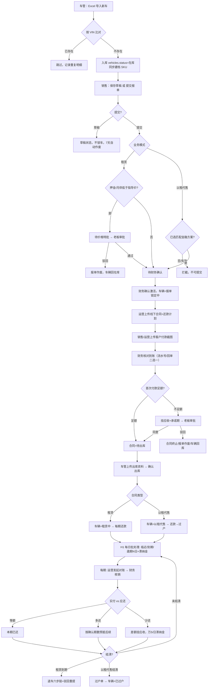

# 金聚源车辆管理系统 · 整体流程文档

- **版本**：v20260813（含 8-01 指导价改版、8-02 尾号字段、8-03 回单可选、8-09 整车销售下线、8-10~8-12 SKU 模式 + 数据字典 + 退车驳回重提）
- **核对基准**：当前工作区代码 app.py / database.py / templates/index.html（未提交改动已纳入）
- **核对方式**：代码逐段核对，附 `文件:行号` 证据
- **维护说明**：改业务规则时请同步更新本文档及 `workflows/*.mmd` 流程图

> **本版重要变更（相对 v20260803）**：
> 1. **整车销售整体下线**：业务模式仅保留「租赁 / 以租代售」两种。`normalize_sales_mode` 已删除销售映射（[app.py:524](app.py#L524)），`sale_total_price` 废弃（[app.py:5600](app.py#L5600)），出库 status_map 删除 `'销售':'已售'`，车辆状态「已售/已过户」更名为「已过户」（仅由以租代售过户触发，[app.py:7514](app.py#L7514)）。
> 2. **SKU 模式落地**：新增 `skus` 表（[database.py:1006](database.py#L1006)），SKU = 基准车型 + 成色 + 厢型 + 尾板，唯一索引 `idx_skus_comb`。启动时 `backfill_skus` 自动回填（[app.py:10485](app.py#L10485)），车辆新增/编辑时 `ensure_sku_for_vehicle` 同步建档（[app.py:4524](app.py#L4524)）。新增 SKU 接口：`GET /api/skus`、`GET /api/skus/inventory`、`GET /api/skus/<id>/vehicles`、`POST /api/skus/<id>/toggle`。
> 3. **数据字典**：新增 `data_dictionaries` 表与 `GET/POST /api/data-dictionaries`、`DELETE /api/data-dictionaries/<id>`；品牌/品系/厢型/能源专属字段从启用字典取值，车辆编辑器 `fuel_form` 只读。
> 4. **以租代售金融方案按子型号维护**：方案绑定「基准车型 + 新车 + 厢型」，`resolve_finance_plan` 按 car_type/condition/box_type 匹配（[app.py:415](app.py#L415)），报单仅可选与 VIN 所属新车厢型一致的启用方案。指导价工作台新接口 `GET /api/model-guidance-workbench`（[app.py:3328](app.py#L3328)）。
> 5. **退车新增老板驳回 / 销售重提**：`POST /api/return-inspections/<rid>/boss-reject`（[app.py:8582](app.py#L8582)）、`POST /api/return-inspections/<rid>/resubmit`（[app.py:8631](app.py#L8631)），驳回后退回销售修改并可重新提交。
> 6. **合同多车桥表**：新增 `contract_vehicles`（[database.py:1023](database.py#L1023)），合同可关联多辆 VIN，`contracts.vehicle_id` 保留主车。

---

## 一、整体流程总览



## 二、角色与职责

| 角色 | 主要职责 |
|---|---|
| 车管 | 车辆入库、出库、退车验车、执行锁车 |
| 销售 | 报单（草稿/提交）、客户付款截图、每期对账发起、退车登记、催收、发起减免/锁车、退车被驳回后修改重提 |
| 运营 | 上传线下合同、维护还款计划、发起首次付款、每期对账发起、登记过户、发起发票申请 |
| 财务 | 确认报单、核对首付款到账、核销每期还款、上传回单、退车复核、退款出款、执行减免、开票/红冲 |
| 老板 | 价格特批、首次付款不足审批、退车领导审批/驳回、减免审批、发票审批、锁车审批、维护指导价/金融方案、维护数据字典、停用/启用 SKU |

## 三、主流程分段详解

### ① 车辆入库（车管）

- 车管上传新车 Excel（[import_vehicles](app.py#L4558)）→ 系统按 **VIN 全库比对**：
  - 已存在 → 跳过，不重复入库，记录导入结果；
  - 不存在 → 写入 `vehicles.status=在库`，并 `ensure_sku_for_vehicle` 自动建档 SKU（[app.py:4743](app.py#L4743)）。
- 导入完成展示新增/重复/失败明细。
- 数据字典校验：`car_type` 拆解维度必须与启用字典匹配（[validate_vehicle_dict](app.py#L708)，签名已扩展为 `(conn, car_type, vehicle=None)` 支持能源类型分组校验），无效车辆拦截报单并提供修正入口。
- **SKU 建档**：SKU = 基准车型 + 成色 + 厢型 + 尾板；底盘车（box_type=底盘）不入 SKU。启动时 `backfill_skus` 幂等回填存量车辆（[app.py:4084](app.py#L4084)）。

### ② 销售报单（销售）

- **保存草稿**：`order_status=草稿`，不锁车，**7 天自动作废**（[expire_sales_order_drafts](app.py#L766)）。
- **提交报单**（[create_sales_order](app.py#L5500)）：校验车辆在库、无进行中报单（锁车）、客户黑名单、数据字典有效 → 进入价格校验。
- **业务模式仅两种**：`normalize_sales_mode`（[app.py:524](app.py#L524)）只接受「租赁 / 以租代售」，其他输入归一为租赁；整车销售入口已删除。
- **底盘车门禁**：`box_type=底盘` 的车辆（含批量 VIN 逐辆校验）不可报单，需先配置实际厢体。

### ③ 价格校验与特批（20260804 口径 + 8-09 销售下线）

- 指导价来源：车型指导价表 `model_guidance_prices`（[resolve_guidance_prices_for_vehicle](app.py#L536)），统一入口 [calculate_guidance_check](app.py#L568)：
  - **租赁** → 双维度校验：**押金 ≥ 车型押金指导价** 且 **月供 ≥ 箱型5选1月供 + 尾板加价**；任一低于或缺指导价 → 触发老板价格特批。
  - **以租代售** → **无价格特批**，只校验是否已选「与车辆新车厢型一致」的启用金融方案（[resolve_finance_plan](app.py#L415)）；未选/方案失效 → 直接拦截，不可提交。
- 金融方案按**子型号**维护：每条方案绑定「基准车型 + 新车 + 厢型」；二手车、底盘车不支持以租代售方案。
- **触发老板价格特批条件**（仅租赁）：非草稿 且（押金或月供 < 对应指导价 或 缺指导价）。
- 状态流转：`待价格特批 →（老板通过）→ 待财务确认`；驳回 → 报单作废、车辆回在库。
- 财务确认激活（[activate_sales_order](app.py#L6149)）：`已激活` + `vehicles.status=报单锁定中`；租赁/以租代售激活前要求先生成客户还款计划（[sales_order_plan_activation_blocker](app.py#L1901)）。

> ⚠️ 注意：**比例口径已整体移除**（8-01）。**整车销售已整体下线**（8-09）：不再存在销售模式报单，此前「销售是否豁免特批」的待确认项随之消除；`sale_total_price` 字段废弃，以租代售仅走金融方案。

### ④ 合同与首次付款（运营 / 财务）

1. **运营上传线下签署合同**（[add_contract](app.py#L6392)）：`contract_status=执行中`、`delivery_status=待首付款`、`contract_file` 必填；同一辆车不能重复签约（历史「报单计划中」壳合同可复用）。**支持多车合同**：通过 `contract_vehicles` 桥表关联多辆 VIN（[database.py:1023](database.py#L1023)），`contracts.vehicle_id` 保留主车。
2. 运营**发起首次付款**（[create_initial_payment](app.py#L7987)）：上传客户付款截图 → 生成 `initial_payment` 审批流（财务审核收款）。
3. 财务**核对到账**（[upload_initial_payment_receipt](app.py#L8063)）：填写公司实际到账金额 + **银行流水号（≥4位）或公司回单，二选一即可**（8-03 改动，回单不再强制）。
4. 金额核对（[finalize_initial_payment](app.py#L1000)）：
   - **足额** → 合同 `待出库`、押金/首付置已收；
   - **不足额** → 自动挂应收 `initial_payment_shortfall` → 承诺期内不计滞纳金、超期按万5/日计提 → **老板审批是否允许不足额出库**：
     - 同意 → 差额保留为应收，允许出库；
     - 驳回 → 合同终止、报单作废、车辆回在库（**退款执行环节缺失，见遗留问题**）。

### ⑤ 出库（车管）

- 车管上传**出库照片 + 出库单照片**（必填，[deliver_vehicle](app.py#L10012)）→ 确认出库：
  - 租赁 → `车辆=租赁中`；
  - 以租代售 → `车辆=以租代售`；
- （8-09 起）**不再存在销售出库直结**：status_map 中 `'销售':'已售'` 分支已删除，出库后客户还款计划第 1 期自动转为「待还款」。

### ⑥ 每期还款与对账（销售/运营 + 财务）

- 运营**发起对账**：填写客户实付金额 + 上传支付凭证截图（[upload_screenshot](app.py#L7749)）。
- 财务**核销**（[confirm_repayment](app.py#L6851)），按瀑布分配（[apply_waterfall_allocation](app.py#L1380)）：
  - **等额** → 本期已还款；
  - **多还** → 必须指定抵扣期数；整期覆盖=`已还款`、部分覆盖=`预抵`（差额后续可补足）；多还超上限拦截；
  - **少还** → 实收记本期已收，**差额挂本期应收**（`period_shortfall`），自逾期日起按**万分之5/日**计滞纳金（无复利）。
- 财务上传银行回单改为**可选**（有流水号即可核销，8-03 改动 [upload_receipt](app.py#L7777)）。
- 对账门禁（[reconciliation_gate_for_repayment](app.py#L2303)）：必须先完成合同上传、首付款审核、车辆出库，且报单已激活。

### ⑦ H1 每日批处理（滞纳金 / 状态推进）

- 统一入口 [run_daily_collect](app.py#L2340)：每日 00:30 定时 + 启动补跑 + 查询惰性兜底（force=True）。
- 逐日推进状态机：`待还款 → 临近还款(-3~-1) → 还款日(0) → 逾期N日(≥1)`。
- 滞纳金：`LATE_FEE_DAILY_RATE = 0.0005`，按 (repayment_id, accrued_date) 幂等写入 `late_fee_ledger`，并同步合同级 `contract_fee_items` 真实应收。

### ⑧ 逾期催收 / 减免 / 锁车（风控）

- **催收 H2**：逾期 T+3 运营催收、T+7 销售催收（`urge_records`）。
- **减免 J3 三段式**：销售发起（滞纳金/租金减免）→ **老板审批** → **财务执行**生效；减免命中期数滞纳金标 waived，同步合同应收。
- **锁车 H4**（[create_lock_request](app.py#L10193)）：逾期满 7 天且该期已有催收记录 → 销售发起 → **运营审核** → **老板审批** → 执行锁车；驳回按 lock/unlock 回退锁状态。

### ⑨ 退车流程（租赁结清）

六步链（[create_return_inspection](app.py#L8182)）：

1. 销售登记（`待车管验车`）
2. 车管验车（[update_return_fleet](app.py#L8348)）
3. 运营查数据（[update_return_operator](app.py#L8411)）
4. 财务复核（[update_return_finance](app.py#L8448)）
5. 老板领导审批（[boss_approve_return](app.py#L8533)，return_stock）
   - **新增（8-12）**：老板可**驳回**（[boss_reject_return](app.py#L8582)），驳回原因必填 → 退车单退回销售修改 → 销售修改后**重新提交**（[resubmit_return_inspection](app.py#L8631)）重新走审批链。
6. 财务出款（[pay_return_refund](app.py#L8701)：写退款流水号/金额）

完成 → 车辆回库或待维修、合同已退车/已结清。审批中心合成展示完整六步（[_synthesize_return_items](app.py#L8766)）。

### ⑩ 过户与提前结清（以租代售）

- **自然到期过户**：分期全部结清 → 运营发起过户单（[create_ownership_transfer](app.py#L7414)，仅允许以租代售合同）→ 运营登记过户资料（[complete_ownership_transfer](app.py#L7483)）→ 车辆=`已过户`（[app.py:7514](app.py#L7514)，8-09 起不再使用「已售/已过户」）、合同=`已结清`。
- **提前结清**（[early_settlement](app.py#L7227)）：结清尾款后**自动生成过户单**（settle_type=early_settle）；多收款挂客户预付款 `customer_prepayments`；客户付款截图不再强制（8-03 改动）。

### ⑪ 发票流程（8-01 新增）

运营发起开票申请（[create_invoice_request](app.py#L5162)）→ **老板审批** → 财务开票填发票号 → 已开票后可**作废**或**红冲**。

### ⑫ 车型规格 / SKU / 数据字典（8-10~8-12 新增）

- **基准车型口径**（[normalize_base_car_type](app.py#L188)）：
  - 纯电 = 品牌 + 品系 + 电池品牌 + 电池度数 + 尾板；
  - 混动/燃油车 = 品牌 + 品系 + 马力 + 档位 + 尾板；
  - 尾板取值仅「有 / 无」；成色、厢型是子型号维度，不属于基准车型。
- **SKU**（`skus` 表，[database.py:1006](database.py#L1006)）：SKU = 基准车型 + 成色 + 厢型 + 尾板，唯一索引 `idx_skus_comb`；底盘车不入 SKU。车辆入库/编辑自动建档（[ensure_sku_for_vehicle](app.py#L4524)），启动自动回填（[backfill_skus](app.py#L4084)）。老板可在 SKU 列表停用/启用某组合（`POST /api/skus/<id>/toggle`），SKU 库存视图：`GET /api/skus/inventory`、`GET /api/skus/<id>/vehicles`。
- **数据字典**（`data_dictionaries` 表）：品牌/品系/厢型/能源专属字段（电池品牌、电池度数、马力、档位）按能源类型分组维护，`GET/POST /api/data-dictionaries`、`DELETE /api/data-dictionaries/<id>`。车辆编辑器中成色/尾板为固定枚举，品牌/品系/厢型及能源专属字段必须从启用字典选择；**`fuel_form`（燃料形式）为采购导入只读字段，接口忽略越权修改**，避免跨能源类型改写。
- **指导价工作台**（`GET /api/model-guidance-workbench`，[app.py:3328](app.py#L3328)）：按基准车型展示五个厢型主行，可展开维护每行的租赁指导价（押金/月供/尾板加价）与以租代售多金融方案（首付/每期/期数/有效期）子表。

## 四、核心状态机速查

### 报单状态 sales_orders.order_status

```
草稿 → 待价格特批 → 待财务确认 → 已激活 → （关联合同流转）
  │        │驳回         │已作废
  │        └→ 已作废     └→ 已作废
  └→（7天）已作废
```

### 合同交付状态 contracts.delivery_status

```
待首付款 → 首付审批中 → 待出库 → 已出库 → 已完成
              │             │
              │不足额        │驳回（首付不足）
              ├→ 首付不足待审批 → 待出库（老板同意）
              │                     └→ 已终止（老板驳回）
              └→ 首付已驳回 → 可重新发起首次付款
```

### 车辆状态 vehicles.status

```
在库 → 报单锁定中 → 待出库 → 租赁中 / 以租代售
  ↑                          │（退车）    │（过户）
  └──────── 回库 / 待维修 ←──┘           └→ 已过户
```

> 8-09 起「已售」状态已删除；「已过户」仅由以租代售过户（自然到期/提前结清）触发。

### 每期还款状态 repayments.status

```
待还款 → 临近还款 → 还款日 → 逾期N日（逾期后逐日推进）
   │         │         │        │
   └─ 已还款 / 部分核销 / 预抵 ←──┘（核销后按分配结果落位）
```

### 退车单状态 return_inspections.status（含 8-12 驳回重提）

```
待车管验车 → 待运营查数据 → 待财务复核 → 待领导审批 ──通过──→ 待财务出款 → 已完成
                ↑                    │
                │                    │老板驳回（原因必填）
                └──── 退回销售修改 ←──┘ → 销售重新提交 → 重新走审批链
```

## 五、关键业务规则

| 规则 | 值 | 位置 |
|---|---|---|
| 业务模式 | 仅 租赁 / 以租代售（整车销售已下线） | [normalize_sales_mode](app.py#L524) |
| 价格特批触发（租赁） | 非草稿 且（押金或月供 < 指导价 或 缺指导价） | [calculate_guidance_check](app.py#L568) |
| 以租代售 | 无价格特批；必须选择匹配子型号的启用金融方案 | [resolve_finance_plan](app.py#L415) |
| 金融方案范围 | 基准车型 + 新车 + 厢型（二手车/底盘车不支持） | [calculate_guidance_check](app.py#L568) |
| 基准车型口径 | 纯电=品牌+品系+电池品牌+电池度数+尾板；混动/燃油=品牌+品系+马力+档位+尾板 | [normalize_base_car_type](app.py#L188) |
| SKU 组合 | 基准车型 + 成色 + 厢型 + 尾板（底盘车不入 SKU） | [database.py:1019](database.py#L1019) |
| 底盘车报单 | box_type=底盘 直接拦截（含批量逐辆校验） | [create_sales_order](app.py#L5500) |
| 草稿有效期 | 7 天自动作废 | [expire_sales_order_drafts](app.py#L766) |
| 滞纳金利率 | 万分之5/日，无复利 | [run_daily_collect](app.py#L2340) |
| 催收节点 | 逾期 T+3 运营 / T+7 销售 | `urge_records` |
| 锁车门槛 | 逾期满 7 天 + 已有催收记录 | [create_lock_request](app.py#L10193) |
| 银行流水号 | ≥4 位（回单可选替代） | [upload_initial_payment_receipt](app.py#L8063) |
| 车辆过户状态 | 已过户（「已售」已删除） | [complete_ownership_transfer](app.py#L7514) |
| fuel_form | 采购导入确定，只读；更新接口忽略越权修改 | 车辆编辑器/更新接口 |

## 六、当前遗留问题（截至 2026-08-13）

| # | 问题 | 影响 |
|---|---|---|
| 1 | 流程图 K1「比例口径」节点已失效（8-01 移除比例校验），`6.2-main-flow.mmd` 等未同步 | 文档落后于代码 |
| 2 | ~~整车销售是否豁免价格特批~~ → **8-09 已消除**：整车销售整体下线，仅剩租赁/以租代售 | 已解决 |
| 3 | 首次付款不足被老板驳回后，**退款执行环节缺失**（只有终止，无退款出款/流水） | 财务只能线下退款 |
| 4 | 老板端无单车**全过程时间线**（只有全表审计日志 100 条） | 追溯体验差 |
| 5 | `workflows/*.mmd` 流程图、`docs/三类业务工作流.md`、`docs/操作手册.md` 仍含「整车销售/卖车流程」分支，未按 8-09 下线同步 | 文档落后于代码 |

## 七、近期验收与测试

- **20260811 全流程验收**：[20260811-租赁与以租代售全流程测试报告.md](20260811-租赁与以租代售全流程测试报告.md) — 20/20 自动化用例通过（P0 回归 14 + 全流程 6），覆盖入库/VIN、底盘车门禁、租赁低价特批、合同/出库双资料门禁、出库后还款计划激活、金融方案快照/有效期、结清过户、回款核销、催收锁车解锁、退车闭环。
- 测试集：`tests/test_august_lease_rent_to_buy_acceptance.py`、`tests/test_august_full_lease_rent_to_buy_flow.py`、`tests/test_sku_document_alignment.py`、`tests/test_initial_payment_rules.py`、`tests/test_strip_box_suffix.py`。

## 八、相关文档索引

- [20260811-租赁与以租代售全流程测试报告.md](20260811-租赁与以租代售全流程测试报告.md) — 最新全流程验收报告
- [sku模式讨论-修订版.md](sku模式讨论-修订版.md) — 车辆规格与定价模块设计（V3.5，SKU/基准车型/字典口径）
- [主流程与流程图一致性分析报告-20260802.md](主流程与流程图一致性分析报告-20260802.md) — 代码 vs 流程图差异详查
- [workflows/6.2-main-flow.mmd](workflows/6.2-main-flow.mmd) — 主流程图（需按 8-01 / 8-09 改版更新）
- [all-flowcharts.html](all-flowcharts.html) — 全流程可视化
- [操作手册-带流程.md](操作手册-带流程.md) — 操作手册（含整车销售描述，待同步）
