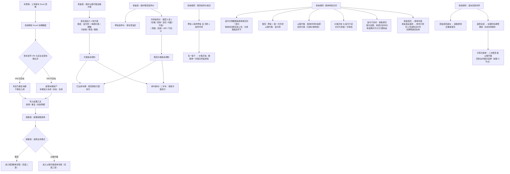
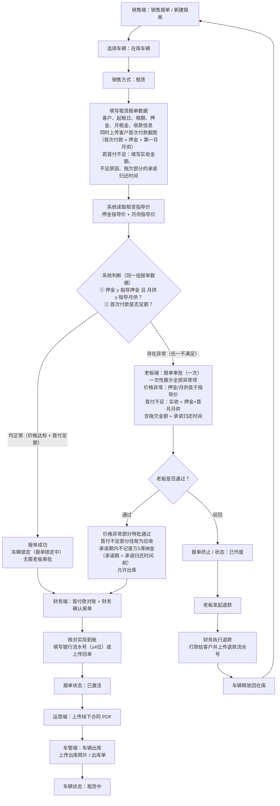
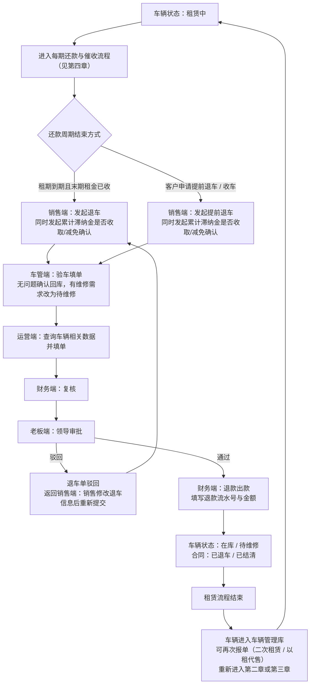
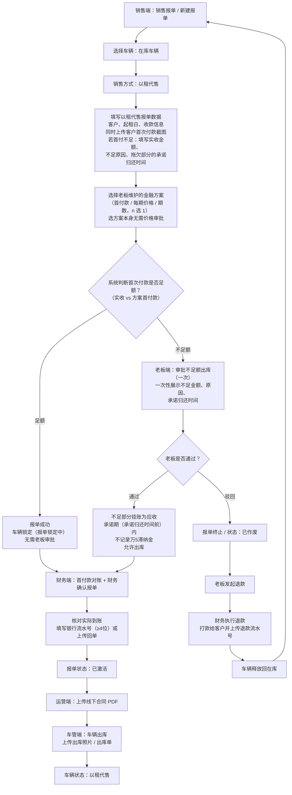
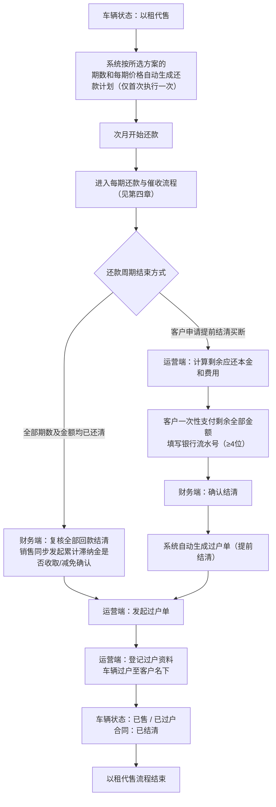
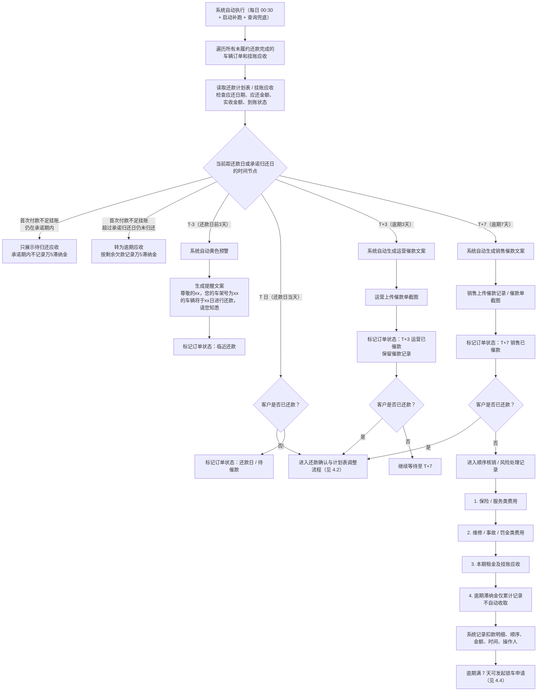
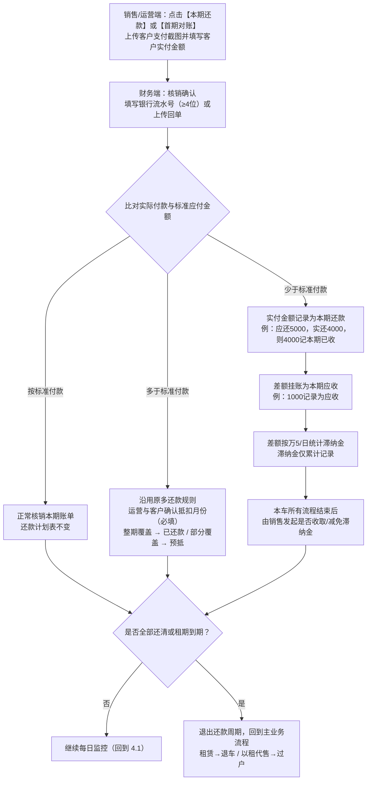
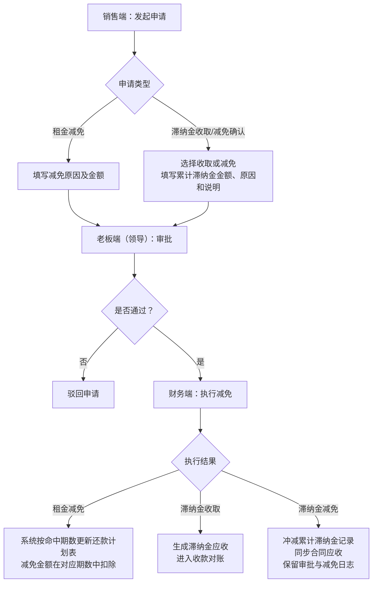
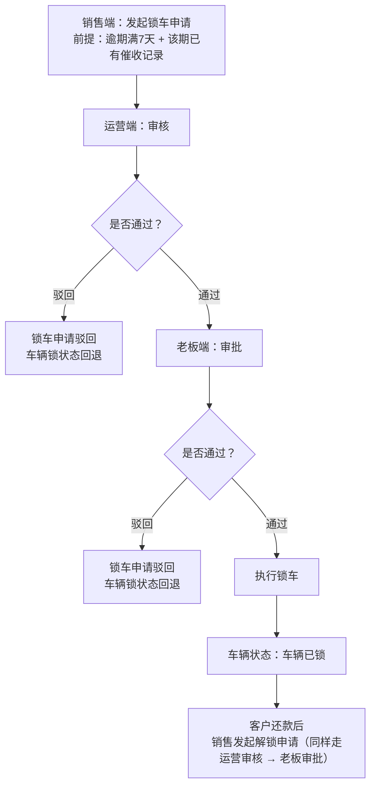
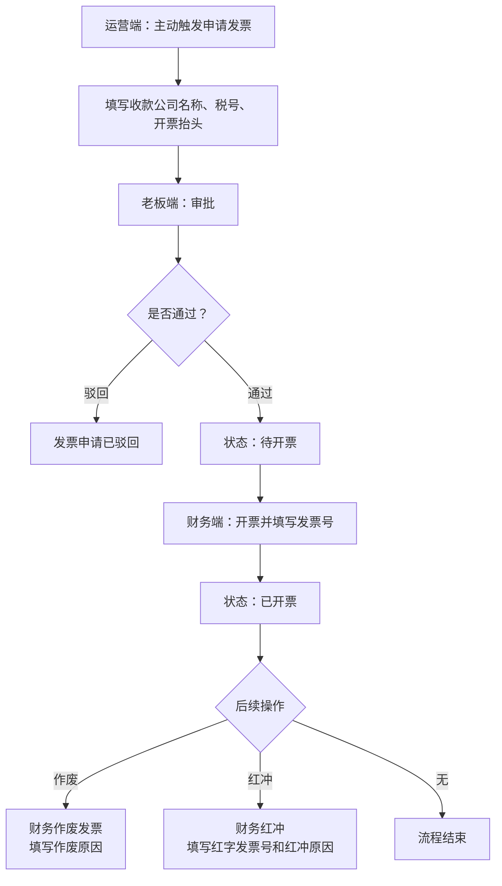

# 流程图（最新规则版 20260804）

> 本版沿用 5.27 原框架，为当前**最新**业务流程版本（2026-08-04），取代 20260803 版。
> 相比 20260803 版的变化：**首次付款截图前移至报单提交过程**（报单成功即完成首次付款上传，不再有报单成功后再单独发起首次付款的环节）。
>
> 最新业务规则要点：
> 1. **取消整车销售环节**，仅保留**租赁**、**以租代售**两条主流业务流程；
> 2. **指导价格判断按业务模式区分**：
>    - **以租代售（以租代购）**：老板按车型设计 n 种金融方案（首付款、每期价格、期数三维度，可自由增删改），销售报单时从老板维护的方案中选择，**无"低于指导价"特批**；方案变更后，**已出库车辆按变更前方案执行，库中新车/二手车按新方案执行**；
>    - **租赁**：**押金与月供两者都不能低于老板指导价**，任一低于 → 老板价格特批；押金 = 老板端该车型押金指导价；月供 = 标箱/宽体/高栏/冷藏/平板（5选1）价格 + 尾板（加装 +300 / 不加 0）；价格变更后，**已出库车辆按变更前价格执行，库中新车/二手车按新价格执行**；
> 3. **报单 → 出库流程顺序**：
>    - 旧顺序：销售报单 → 系统判断是否低于指导价 → 系统生成报单 → 财务确认 → 运营上传合同 → 运营发起首次付款 → 首次付款判断 → 财务首付款对账 → 车管出库
>    - 新顺序：**销售报单过程即上传客户首次付款截图**（报单提交时一个动作完成：租赁 = 押金 + 第一月月供，以租代售 = 首付款，同时以租代售需选择还款方案）→ **报单审批（一次）** → **首付款对账 + 财务报单确认** → **运营上传合同** → **车管出库** → 车辆状态：租赁中 / 以租代售
>    - 注：首次付款截图是**报单提交的一部分**，报单成功即完成首次付款上传，不存在报单成功后再单独发起首次付款的环节。
> 4. **报单审批合并为一次**：首付截图前移后，销售报单时已同时填齐押金、月租金、首付金额并上传截图，**价格特批（押金/月供低于指导价）与首付不足审批判断的是同一组报单数据**，故合并为**老板一次审批**——系统一次性展示全部异常项（价格异常 / 首付不足），老板一次决策；通过后不足部分挂应收、允许出库，驳回则报单作废、车辆回在库。
>    - **首付不足的承诺规则**：销售在报单时须填写**拖欠金额、承诺归还时间**；承诺期内（承诺归还时间之前）该拖欠部分**不计万5滞纳金**，超过承诺时间未还则转为逾期应收、按剩余欠款开始计滞纳金。
>    - **驳回后的退款闭环**：老板驳回 → 报单作废 → **老板发起退款 → 财务执行退款（打款给客户并上传退款流水号）→ 车辆释放回在库**，可重新报单。
> 5. **退车流程闭环**：
>    - 老板驳回退车 → 退车单驳回，**返回销售端修改后重新提交**，形成内部闭环；
>    - 退车退款完成后 → 车辆回**车辆管理库（在库 / 待维修）**，可**再次报单（二次租赁 或 以租代售）**，形成业务大循环。

# **一、全局规则**

# 二、租赁流程

### 2.1 报单（含首付截图）→ 老板一次审批 → 财务确认 → 合同 → 出库

### 2.2 还款周期 → 退车 → 车辆回库（可二次报单）

# 三、以租代售流程

### 3.1 报单（选方案 + 首付截图）→ 足额判断（一次审批）→ 财务确认 → 合同 → 出库

### 3.2 初始化 → 还款周期 → 过户

# 四、每期还款、催收与计划表调整（租赁 / 以租代售共用）

说明：本章为租赁（第二章）和以租代售（第三章）在还款阶段共用的流程。系统每日自动执行，对所有未履约还款完成的车辆订单进行状态查询、催收和滞纳金累计记录。首次付款足额的判断已前移至报单环节（见 2.1 / 3.1），本章仅处理每期还款的少还 / 多还。

### 4.1 每日监控与逾期催收

### 4.2 还款确认与计划表调整

说明：当客户在任意时间点完成付款后（无论是否逾期），均进入本流程进行确认与计划表调整。多还款沿用原规则；少还款按本版新规则处理。

### 4.3 租金减免 / 滞纳金收取确认流程

说明：在每期分期还款计划中可触发租金减免；本车流程结束时，由销售发起累计滞纳金是否收取或减免。

### 4.4 逾期锁车流程

说明：逾期满 7 天且该期已有催收记录后，销售方可发起锁车申请。

### 4.5 发票申请流程

说明：在租赁和以租代售的首期及每一期还款计划中均可触发，只有运营主动才可以触发。

---

## 附：版本差异对照

### 与 20260803 版差异

| 环节 | 20260803 版 | 20260804 版（当前） |
|---|---|---|
| 首次付款时机 | 报单成功后上传截图 | **首次付款截图是报单提交过程的一部分**，报单成功即完成上传，无单独发起环节 |
| 报单 → 出库顺序 | 报单 → 首付截图 → 足额判断 → 对账 + 财务确认 → 合同 → 出库 | 与 0803 版一致（首付已在报单过程内完成） |
| 报单审批次数 | 价格特批 与 首付不足审批分两次 | **合并为老板一次审批**（价格异常 + 首付不足一次性展示，一次决策） |
| 驳回后处理 | 报单作废、车辆直接回在库 | **老板发起退款 → 财务打款给客户并上传退款流水号 → 车辆回在库** |

### 与旧版（含整车销售）差异

| 环节 | 20260803 版（含整车销售） | 20260804 版（当前） |
|---|---|---|
| 业务模式 | 租赁 / 以租代售 / 整车销售 | **仅租赁 / 以租代售（整车销售已移除）** |
| 以租代售定价 | 报价 vs 整车指导价，低于走价格特批 | **老板维护 n 种金融方案（首付款 / 每期价格 / 期数），销售报单时选方案，无特批** |
| 租赁定价 | 月供 vs 租赁月供指导价（单项） | **押金 + 月供双维度均不得低于指导价**；月供 = 箱型 5 选 1 + 尾板（+300 / 0） |
| 方案 / 价格变更 | 快照版本控制 | **已出库车辆按变更前方案执行，库中新车 / 二手车按新方案执行** |
| 首次付款时机 | 运营上传合同后发起 | **报单提交过程即上传截图**（租赁 = 押金+首月月供，以租代售 = 首付款） |
| 报单审批次数 | 价格特批 与 首付不足审批分两次 | **合并为老板一次审批**（价格异常 + 首付不足一次性决策） |
| 出库前顺序 | 报单 → 价格判断 → 财务确认 → 合同 → 首付 → 对账 → 出库 | **报单（含首付截图）→ 一次审批 → 首付款对账 + 财务确认 → 合同 → 出库** |
