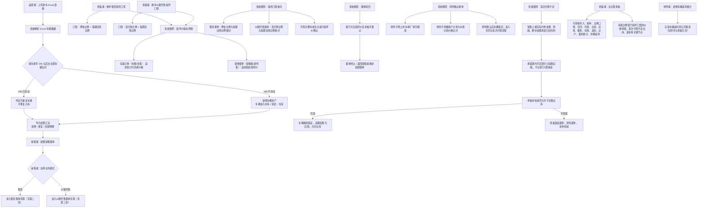
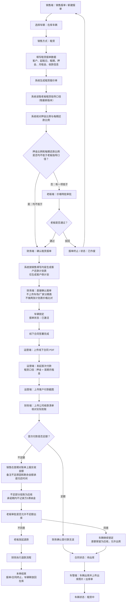
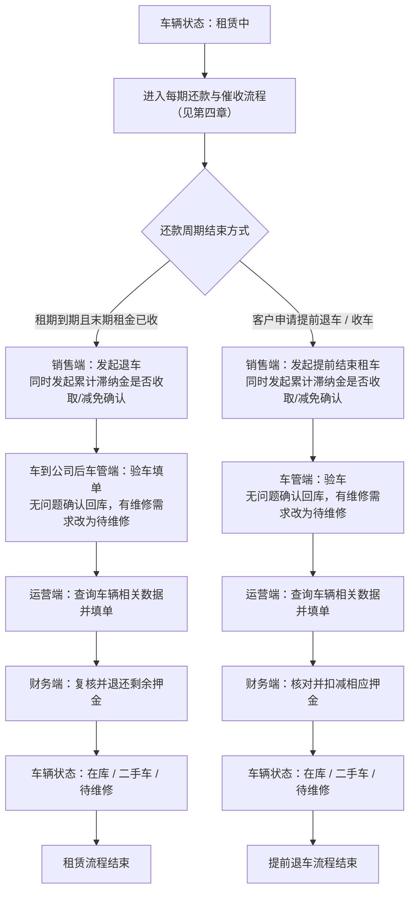
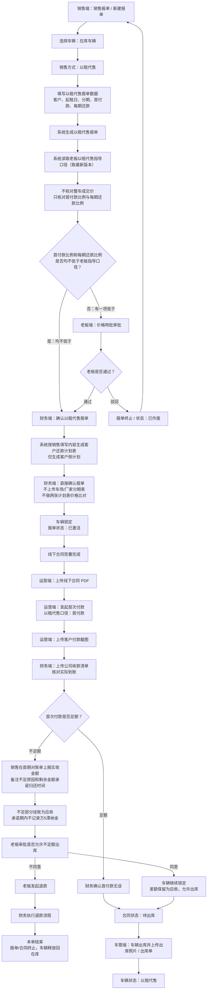
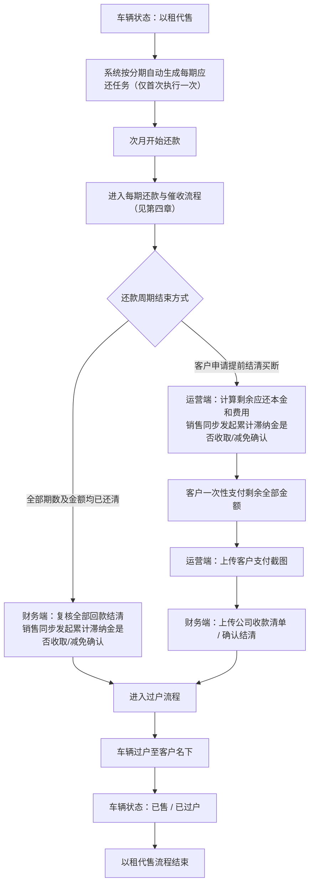
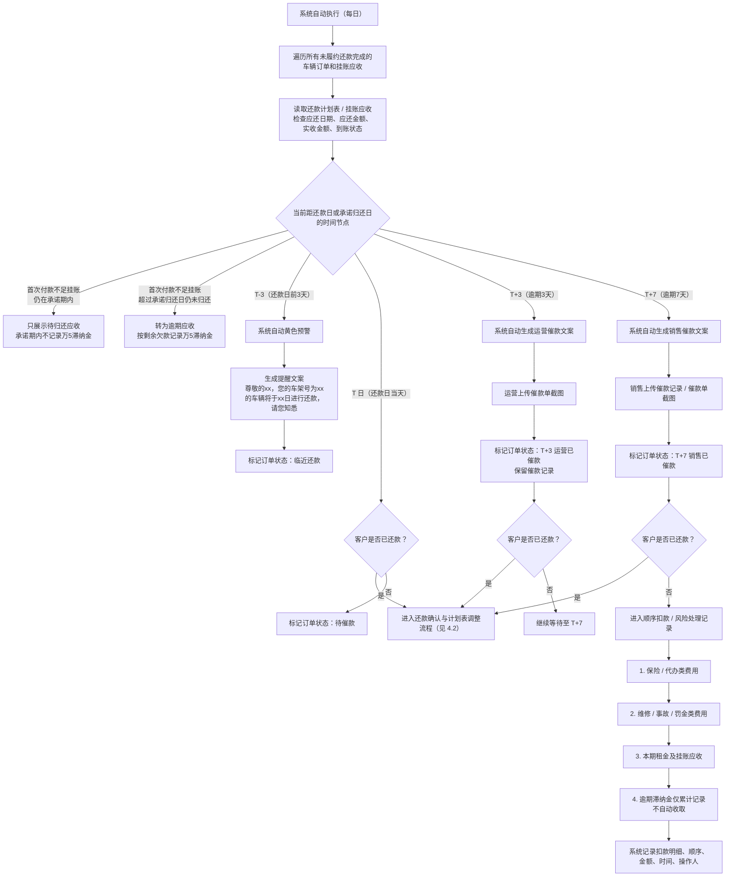
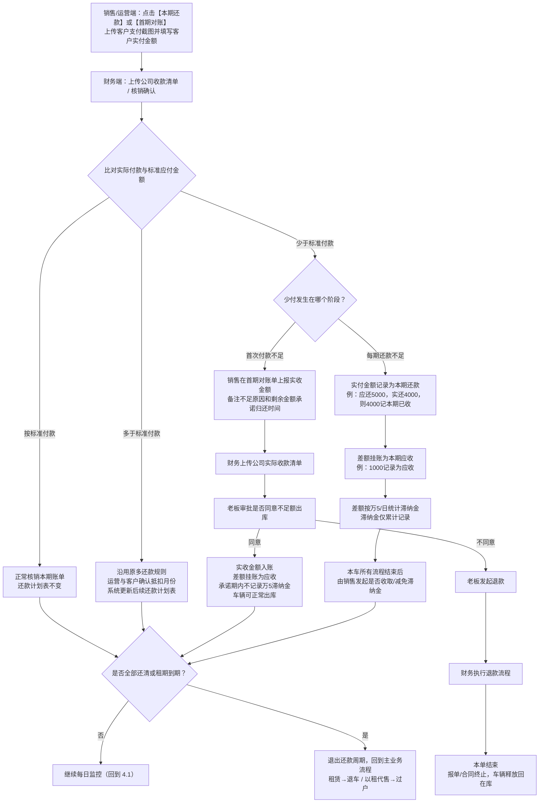
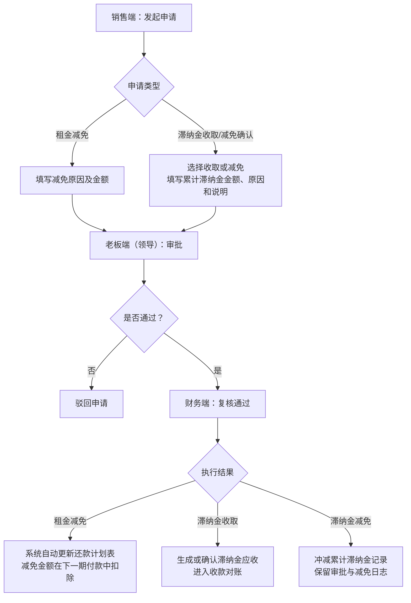
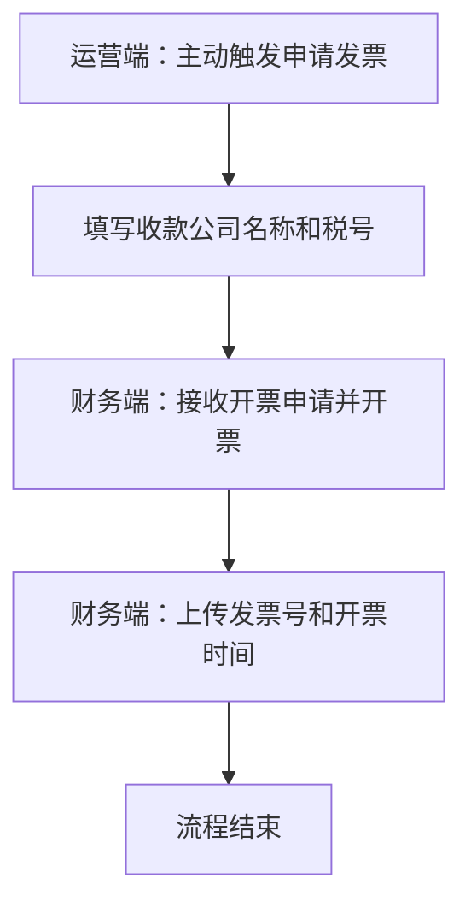

# 流程图 5.27（按新规则调整版）

> 本版沿用 5.27 原框架：全局规则、租赁流程、以租代售流程、每期还款/催收/计划调整、租金减免、发票申请。
> 主要调整：新车由运营 Excel 导入并按车架号去重；指导价不再按整车价确认，以租代售核对首付款比例和每期还款比例，租赁核对押金比例和每期还款比例；财务确认报单不再上传车场/厂家分期表；首次付款不足增加老板审批、挂账应收、退款终止分支；每期少还不再顺延到下期，而是差额挂应收并按万5统计滞纳金。

# **一、全局规则**

# 二、租赁流程

### 2.1 报单 → 审批 → 出库

### 2.2 还款周期 → 退车

# 三、以租代售流程

### 3.1 报单 → 审批 → 出库

### 3.2 初始化 → 还款周期 → 过户

# 四、每期还款、催收与计划表调整（租赁 / 以租代售共用）

说明：本章为租赁（第二章）和以租代售（第三章）在还款阶段共用的流程。系统每日自动执行，对所有未履约还款完成的车辆订单进行状态查询、催收和滞纳金累计记录。

### 4.1 每日监控与逾期催收

### **4.2 还款确认与计划表调整**

说明：当客户在任意时间点完成付款后（无论是否逾期），均进入本流程进行确认与计划表调整。多还款沿用原规则；少还款按本版新规则处理。

### 4.3 租金减免 / 滞纳金收取确认流程

说明：在每期分期还款计划中可触发租金减免；本车流程结束时，由销售发起累计滞纳金是否收取或减免。

### 4.4 申请发票流程

说明：在租赁和以租代售的首期及每一期还款计划中均可触发。只有运营主动才可以触发。

