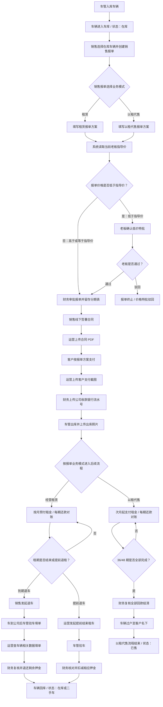

# 经营租赁与以租代售流程闭环

本文档根据最新业务口径和《销售报单信息2.pdf》整理，覆盖车辆入库、车库资产、销售报单选择业务模式、指导价判断、财务审批、分期表留存、合同上传、首付款/押金收款、车辆出库、每期还款对账、逾期催收、顺序扣款、租车回库和以租代售期满过户。

## 一、总流程闭环

## 二、核心业务规则

### 1. 车辆入库与业务入口

- 车管负责车辆入库，车辆入库后直接进入车库，系统车辆状态为“在库”。
- 只有“在库”车辆可以被销售发起销售报单。
- 经营租赁期满后车辆回库；以租代售期满并结清后车辆过户给客户。

### 2. 老板指导价权限

- 老板端可维护每辆车的指导价。
- 老板在某一时间点修改某辆车指导价后，系统记录旧指导价、新指导价、修改人和生效时间。
- 生效时间之后，该车辆新发起的报单按新指导价判断和调整。
- 生效时间之前已经创建的报单、合同、还款计划和历史价格快照保持原价格，不回写、不重算。
- 只有报单价格低于老板指导价时，才进入老板确认审批。
- 报单价格高于或等于老板指导价时，老板不参与审批，直接进入后续财务、运营、车管流程。
- 老板端保留全过程查看权限，可查看报单、审批、合同、收款、出库、还款、催收、扣款、退车、过户和结果记录。

### 3. 业务模式选择点

- 销售报单填单时就选择业务模式：租赁或以租代售。
- 选择后，销售按照对应业务模式填写报单方案，包括租期/分期、押金/首付款、月租金、起租日等。
- 后续财务审批、分期表上传、合同上传、客户付款、财务流水确认和车管出库，按已选择的业务模式执行。
- 车辆出库后，不再重新选择业务模式，而是按销售报单中已经确定的模式进入后续分期还款闭环。

### 4. 经营租赁

- 还款计划表最短 1 个月。
- 客户支付租车押金。
- 客户按月预付租金。
- 租期结束并完成验车、费用核对后，退还剩余租车押金。

### 5. 以租代售

- 还款计划表为 36 个月或 48 个月。
- 客户支付首付款。
- 客户次月开始支付租金。
- 全部期数结清后，车辆过户给客户。

## 三、销售报单字段

销售报单填单时先选择业务模式，再填写对应字段。租赁和以租代售可以分成两个报单流程展示，但都需要经过指导价判断、财务确认并上传分期文件、合同上传、客户付款确认和车管出库。

### 1. 租赁报单字段

企业客户：

- 公司名称、联系人姓名、手机号
- 车辆信息：车架号、颜色、车牌号、车厢尺寸、车型号
- 支付信息：起租日、租期、押金、月租金
- 收款信息：用于退押金

个人客户：

- 姓名、身份证号、驾驶证、手机号
- 车辆信息：车架号、颜色、车牌号、车厢尺寸、车型号
- 支付信息：起租日、租期、押金、月租金
- 收款信息：用于退押金

### 2. 以租代售报单字段

企业客户：

- 公司名称、联系人姓名、手机号
- 车辆信息：车架号、颜色、车牌号、车厢尺寸、车型号
- 支付信息：起租日、分期、首付款、月租金

个人客户：

- 姓名、身份证号、驾驶证、手机号
- 车辆信息：车架号、颜色、车牌号、车厢尺寸、车型号
- 支付信息：起租日、分期、首付款、月租金

## 四、出库前共同闭环

### 1. 报单与价格判断

1. 销售选择车库中的在库车辆，创建销售报单。
2. 销售在报单中选择业务模式：租赁或以租代售。
3. 销售按照所选业务模式填写客户信息、车辆信息、起租日、租期/分期、押金/首付款、月租金、收款信息和报单方案。
4. 系统读取报单创建时的车辆指导价，并保存指导价快照。
5. 系统判断报单价格是否低于指导价。
6. 高于或等于指导价：不经过老板，进入财务报单审批。
7. 低于指导价：先进入老板确认审批；老板通过后进入财务报单审批，驳回则流程终止。

### 2. 报单审批与分期表

1. 财务审批销售报单，核对业务模式、客户、车辆、分期/租期、首付款/押金、月租金、起租日、报单价格和收款方案。
2. 财务审批节点同步上传或留存分期表格，分期表为“解放给关联公司的”还款计划表。
3. 财务确认报单和分期表通过后，报单进入可签约状态。

### 3. 合同签署与上传

1. 销售线下与客户签署合同。
2. 运营将已签署合同扫描或导出为 PDF。
3. 运营上传合同 PDF 到系统。
4. 系统记录合同 PDF，供财务、运营、销售、车管和老板端按权限查看。

### 4. 首次收款

1. 客户按照销售报单方案支付首付款/押金/首期月租金。
2. 运营上传客户支付截图。
3. 财务核对公司银行到账。
4. 财务上传公司首款银行流水号。
5. 系统记录首次收款已完成。

### 5. 车辆出库

1. 首次收款完成后，车辆进入待出库状态。
2. 车管核对车辆、车牌、车架号、客户和合同信息。
3. 车管办理出库，并保留出库照片。
4. 车管上传或留存出库照片到系统。
5. 系统将车辆状态更新为“已出库”。
6. 出库完成后，系统按销售报单中已选择的业务模式，进入租赁或以租代售后续分期还款流程。

## 五、租赁流程

### 1. 出库后进入租赁

1. 销售报单已选择“租赁”，车辆出库后进入租赁流程。
2. 系统将车辆状态更新为“租赁中”。
3. 系统按照租车方案生成后续每期还款计划。
4. 还款计划表最短 1 个月，客户按月预付租金。

### 2. 每期还款对账

1. 系统按照租车方案生成每期还款对账任务。
2. 下一期还款日为 T 日。
3. 距离下一次还款日 T-5 日，系统自动将该期账单标记为黄色预警。
4. 距离下一次还款日 T-3 日，系统提示“还有 3 日进行下一期还款”。
5. 客户支付当期租金后，运营上传客户付款截图。
6. 财务核对银行到账，上传银行流水单号。
7. 财务确认后，该期账单状态变为已还款。
8. 系统继续进入下一期还款循环，直到租期结束或提前结束租车。

### 3. 到期退车入库

1. 租期结束后，销售发起退车。
2. 车到公司后，车管验车填单，记录车辆外观、里程、工具、证件、损伤、照片等。
3. 运营查询车辆相关数据并填单，包括违章、ETC、保养、事故、维修、应收未收租金等。
4. 财务复核押金、应扣费用、已收租金、应退金额和退款账户。
5. 财务复核并退还剩余租车押金。
6. 车管确认车辆入库。
7. 系统关闭租赁合同，车辆回到车库，状态更新为“在库”或“二手车”。

### 4. 提前结束租车

1. 运营发起提前结束租车。
2. 车管验车并填写验车单。
3. 财务核对押金、应扣款项、已收款项和应退金额。
4. 财务从押金中扣减相应款项，剩余部分退还客户。
5. 车管确认车辆回库。
6. 系统关闭或终止租赁合同，并保留提前结束原因和扣款明细。

## 六、以租代售流程

### 1. 出库后进入以租代售

1. 销售报单已选择“以租代售”，车辆出库后进入以租代售流程。
2. 系统将车辆状态更新为“以租代售”。
3. 系统按照以租代售方案生成 36 期或 48 期还款计划。
4. 客户已完成首付款支付，次月开始支付租金。

### 2. 每期还款对账

1. 系统按以租代售方案生成每期还款任务。
2. 客户从次月开始支付租金。
3. 下一期还款日为 T 日。
4. 距离下一次还款日 T-5 日，系统自动将该期账单标记为黄色预警。
5. 距离下一次还款日 T-3 日，系统提示“还有 3 日进行下一期还款”。
6. 客户支付当期租金后，运营上传客户付款截图。
7. 财务核对银行到账，上传银行流水单号。
8. 财务确认后，该期账单状态变为已还款。
9. 系统循环执行，直到 36 期或 48 期全部结清。

### 3. 期满过户

1. 系统识别全部期数已还清，并标记合同为待结清/待过户。
2. 财务复核首付款、每期租金和应收款项均已结清。
3. 财务确认结清后，进入车辆过户流程。
4. 车管或指定经办人办理车辆过户。
5. 车辆过户至客户名下。
6. 系统将合同状态更新为已结清，车辆状态更新为已售或已过户。

## 七、还款提醒、逾期催款与顺序扣款

### 1. 临近还款提醒

- 下一期还款日为 T 日。
- T-5 日：系统自动标记黄色预警，提醒运营、销售和财务关注。
- T-3 日：系统提示“还有 3 日进行下一期还款”。
- T 日：系统显示当期应还款，可由运营上传客户付款截图，财务上传银行流水号并核销。

### 2. 逾期催款

- T+3 日：如客户仍未完成还款，运营进行催款，并上传催款单截图。
- T+7 日：如仍未完成还款，销售进行催款，并上传催款记录或催款单截图。
- T+7 日销售催款无效后，进入顺序扣款流程。
- 催款记录需保留催款时间、催款角色、催款人、催款方式、截图附件和处理结果。

### 3. 顺序扣款

T+7 催款无效后，按以前方案的瀑布式顺序扣款：

1. 保险/代办类费用
2. 维修/事故/罚金类费用
3. 逾期滞纳金
4. 本期租金

扣款结果：

- 到账或可扣金额不足时，系统优先冲抵高优先级费用。
- 若本期租金未冲满，该期账单状态为部分核销或逾期。
- 若全部冲满，该期账单状态为已还款。
- 所有扣款明细、抵扣顺序、金额、操作人和时间必须留痕，老板端可查看。

## 八、角色分工

| 角色 | 关键职责 |
| --- | --- |
| 老板 | 维护指导价；审批低于指导价的价格特批；查看全过程和结果记录 |
| 销售 | 发起销售报单；线下签署合同；租赁到期发起退车；T+7 销售催款 |
| 运营 | 上传合同 PDF；上传客户支付截图；每期还款对账；T+3 运营催款；提前结束租车发起 |
| 财务 | 审批报单；上传或留存分期表格；核对到账；上传银行流水号；核销还款；复核退车扣款和押金退款；确认以租代售结清 |
| 车管 | 车辆入库；车辆出库并上传照片；退车验车填单；车辆回库；以租代售期满过户协同 |
| 系统 | 指导价快照；审批流转；还款计划生成；T-5/T-3 提醒；逾期状态；顺序扣款；全过程留痕 |

## 九、关键状态建议

### 1. 车辆状态

- 在库
- 锁定中
- 待出库
- 已出库
- 租赁中
- 以租代售
- 待回库
- 已回库
- 已售/已过户

### 2. 报单状态

- 草稿
- 待价格判断
- 待老板价格特批
- 价格特批驳回
- 待财务审批
- 财务驳回
- 已审批/可签约

### 3. 合同状态

- 待上传
- 待财务复核
- 待首次收款
- 待出库
- 执行中
- 待退车
- 待结清
- 已结清
- 已终止

### 4. 账单状态

- 待还款
- T-5 黄色预警
- T-3 临近提醒
- 已上传付款截图
- 待财务核销
- 已还款
- 部分核销
- 逾期
- T+3 运营已催款
- T+7 销售已催款
- 已进入顺序扣款

## 十、闭环检查点

- 没有车辆入库记录，不允许报单。
- 销售报单没有选择业务模式，不允许提交财务审批。
- 没有通过指导价判断或老板低价特批，不允许财务审批。
- 没有财务审批报单并留存分期表，不允许签约进入合同流程。
- 没有上传合同 PDF，不允许发起首次收款确认。
- 没有完成押金/首付款/首期租金收款确认，不允许车辆出库。
- 没有车管出库照片，不允许车辆状态变更为已出库；出库后只能按销售报单中已选择的业务模式进入租赁中或以租代售。
- 每期还款必须同时有运营付款截图和财务银行流水号，才允许核销。
- 逾期催款必须上传催款单截图或催款记录附件。
- T+7 催款无效后，才进入顺序扣款。
- 经营租赁没有完成验车、运营数据核查、财务复核，不允许退押金并关闭合同。
- 以租代售没有全部结清，不允许过户。
- 所有关键动作必须写入日志，老板端可查看过程和结果。
